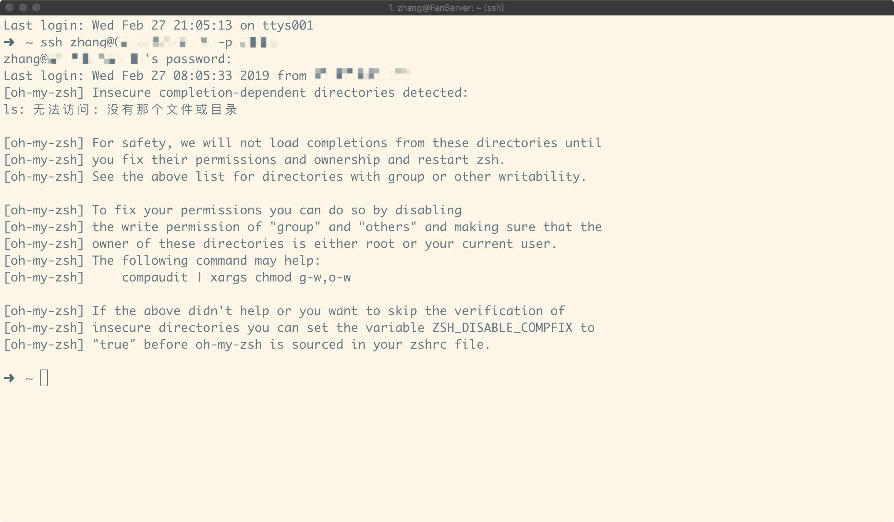

# 服务器初始配置

## 背景说明

在搬瓦工上购买的VPS，操作系统是CentOS 6。选择CentOS是因为搬瓦工上CentOS有预装bbr的，据说网速会快一点；选择6而不是7是因为搬瓦工上6可以一键开启SSR服务（后来改用7了，因为新买的没有一键SS了，不如用新一点了……）。  
新的服务器，拿来总需要一些基本都配置，这篇文章记录了首次通过SSH登录服务器后所做都一些初始配置，包括新建用户、sudo权限分配、SSH设置以及Zsh的配置等。  

## 用户管理

购买了VPS之后，搬瓦工给了我root密码以及SSH端口号，可以使用root身份登录到服务器中。不过众所周知，使用root是十分危险到，因此需要设置一个一般用户；而我自己使用这个系统，还需要为我这个用户分配sudo权限，便于安装软件、修改系统配置等。  
```shell
useradd -m zhang
```
这里通过`useradd`命令添加了一个用户，使用`-m`参数可以在创建用户的同时为该用户在`/home/`目录中创建一个用户名同名的目录并设置为该用户的主目录。  
```shell
passwd zhang
```
这里通过`passwd`命令修改`zhang`的密码。Linux系统中输入密码时没有任何显示，输入后再确认输入即可。  
```shell
visudo
```
通过`visudo`命令来编辑sudo权限设置，找到`root`的配置行，并在下面加入`zhang`的配置，使得我在使用`sudo`时可以有管理员权限。  
```
## Allow root to run any commands anywhere
root     ALL=(ALL)          ALL
zhang    ALL=(ALL)          ALL
```

## SSH配置

SSH的配置文件位于`/etc/ssh/sshd_config`，我尝试使用`vim`来编辑该文件，结果发现这系统干净得连`vim`都没有，只能先安装一下。  
```shell
yum update
yum install vim
```
装软件的时候不禁感慨，国外的服务器网速就是快，不像我们，光是各种配置镜像、配置代理就劝退不少初学者了。  
安装后，编辑配置文件，设置禁用root登录，并修改SSH所用端口号为xxxx（我配置文件中这两项正好是文件的最后两行）。  
```
PermitRootLogin no
Port xxxx
```
修改后重新启动服务
```shell
service sshd restart
```
登出系统后再使用root登录，发现已经登不上去了；使用用户名`zhang`和密码在修改后的端口上可以成功登录。  

## 主机名称修改
主机名字默认是host，不个性，必须改成一个炫酷点的。一开始我编辑的如下文件：  
```shell
sudo vim /etc/hostname
```
保存后通过`sudo reboot`重启服务器，再次登录发现主机名字仍然是host。后来又谷歌一番发现之前那种玩儿法是针对Ubuntu的，在CentOS上需要另外的姿势：  
```shell
sudo vim /etc/sysconfig/network
```
设置其中的`HOSTNAME`字段，保存后重启服务器，再次登录发现主机名字已经修改成功。  

## Zsh配置
CentOS系统默认的shell是bash，不过我比较习惯使用Zsh，主要是一开始Zsh可以配置得很漂亮很舒服，后来用习惯了就一直在用。  
```shell
sudo yum install zsh
```
接下来，安装oh-my-zsh，用来对Zsh做一些配置和美化工作。按照[项目官网](https://github.com/robbyrussell/oh-my-zsh)上的指南，使用如下命令：  
```shell
sh -c "$(curl -fsSL https://raw.githubusercontent.com/robbyrussell/oh-my-zsh/master/tools/install.sh)"
```
安装过程中需要输入密码以为用户更换默认shell。安装后重新登录，可以发现已经成功使用Zsh了，不过貌似一开始报了许多警告。  

为什么这个图截出来没有背景照片呢？好不容易摆到我蕾姆老婆脸上……  
按照报警中的提示，我们在`.zshrc`文件`source`之前加入如下一行：  
```
ZSH_DISABLE_COMPFIX=true
```
重新登录到服务器，可以发现已经没有警告了。  
PS: 后来我改用了CentOS 7以后，配置这里就没有发生警告了……