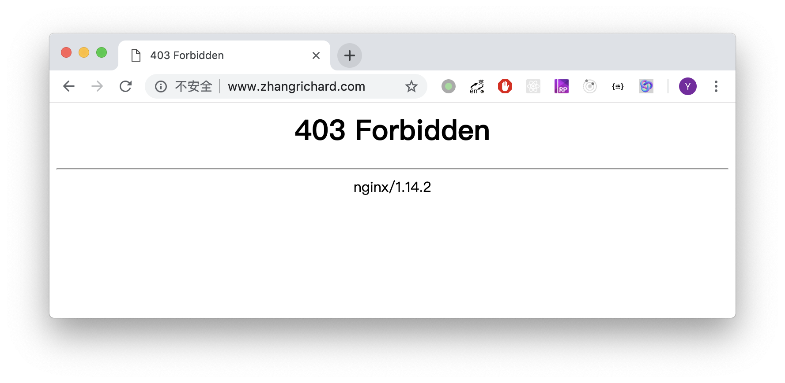

# 静态网站主页

## 背景说明
有了自己的服务器之后，首先想到的就是搭建一个博客发布的平台，能够秀一下自己写的这些乱七八糟的东西，虽然写的不是很好。之前我们搭建Web服务器，一般是用LAMP套装，也即Linux + Apache + MySQL + PHP。不过最近几年，由于Apache实在过于重量级，加上Nginx性能确实是屌，所以一般情况下就使用Nginx作为服务端顶在最前面屌服务了。  
Nginx功能强大，可以做静态服务、反向代理等功能，还可以自己写插件来实现其他的各种想法。这里我先使用最简单的静态文件服务功能，将一个很简单的HTML静态页面作为网站的主页。以后有时间再一步一步地完善我们的网站，加入更多更复杂的功能。  

## Nginx基本安装
如之前文章所说，我们的系统是CentOS 7，按照[官方文档](http://nginx.org/en/linux_packages.html#RHEL-CentOS)上面的说明，需要进行如下几步。  
首先安装一些依赖项：  
```shell
sudo yum install yum-utils
```
之后，设置仓库，需要创建`/etc/yum.repos.d/nginx.repo`文件，并填入以下内容：  
```
[nginx-stable]
name=nginx stable repo
baseurl=http://nginx.org/packages/centos/$releasever/$basearch/
gpgcheck=1
enabled=1
gpgkey=https://nginx.org/keys/nginx_signing.key

[nginx-mainline]
name=nginx mainline repo
baseurl=http://nginx.org/packages/mainline/centos/$releasever/$basearch/
gpgcheck=1
enabled=0
gpgkey=https://nginx.org/keys/nginx_signing.key
```
最后，使用`yum`安装即可：  
```shell
sudo yum update
sudo yum install nginx
```
安装期间，会提示是否倒入GPG key，选择是即可。  
安装成功后，需要启动Nginx，并将其设置成开机启动：  
```shell
sudo systemctl start nginx
sudo systemctl enable nginx
```
这时，访问我们的网站（默认为80端口，我已经将域名映射到服务器的IP地址了），就可以显示出Nginx的欢迎页面。  


## 简单静态页面制作
接下来，我们做一个非常非常简陋的HTML文件，作为网站的首页。  
```HTML
<!DOCTYPE html>
<html>
  <head>
    <meta charset="utf-8">
    <title>个人站点</title>
  </head>
  <body>
    <p>没错，这个网站现在就只是这么简单</p>
  </body>
</html>
```
把这个HTML文件放置在我个人的主目录中，存储为`/home/zhang/static/pages/index.html`  

## Nginx静态文件服务
这里需要修改Nginx的配置文件`/etc/nginx/nginx.conf`来使得Nginx将80端口的根路径指向文件系统中的某个文件夹。我们在http区段的最后，加入如下配置信息  
```
server {
    listen 80 default_server;
    listen [::]:80 default_server;
    server_name _;

    root /home/zhang/static/pages/;

    include /etc/nginx/default.d/*.conf;
}
```
其中的`root`指令将本机80端口网站的根目录指向了之前我们创建的静态文件目录。  
保存配置文件后，我们使用如下两条命令来使得Nginx动态加载配置文件（第一条命令为测试，测试我们的配置文件是否有错误；没有问题后运行第二句，动态加载配置）：  
```shell
sudo nginx -t
sudo nginx -s reload
```
刷新浏览器，果然有了变化，不过居然提示403 Forbidden，禁止访问。  

我们再来看一下Nginx的配置文件，原来最上面有一个user配置，是指运行Nginx的用户，默认是`nginx`，这个用户并没有我个人目录`/home/zhang`中的访问权限，因此报了403错误。我们将最上面的用户改成`zhang`再次重新加载配置文件，刷新浏览器，发现已经可以正确出现我们高端的主页了。  

至此，我们已经完成了静态网站主页的部署了。  