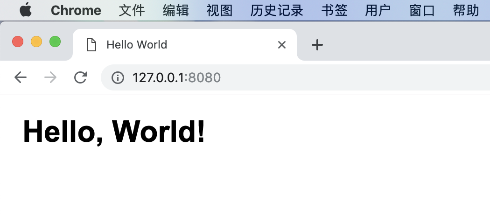
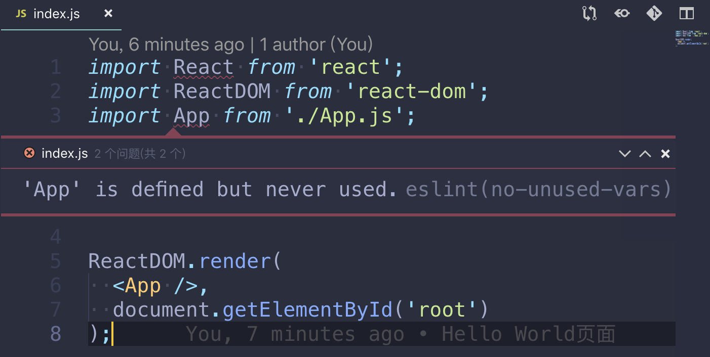

# 前端工程初始化

## 背景说明
之前通过Nginx实现了特别简单的静态文件服务，但是太丑了。我希望实现的是一个个人站点，包括访客的预览、管理后台等，因此简单的静态页面没法满足我的需要。在工作上，我使用React配合阿里的AntD Pro，这里希望使用点不一样的东西，又不希望有太高的学习成本，因此考虑使用React + MaterialUI。  
工作上的各项目都是使用阿里的脚手架搭建好了，里面有一些东西一知半解，这次希望从头开始，一点点把工程配置起来，通过这次折腾的机会也希望自己学习一下。  

## 参考资料
主要参考了逼乎上的这篇[《从头开始创建一个React应用》](https://zhuanlan.zhihu.com/p/36137966)。参考这篇文章时一开始很顺利，后面由于版本问题绕了很多弯路，感谢Google、Github、StackOverflow等网站，后来主要参考这篇老外的[《React + Webpack 4 + Babel 7 Setup Tutorial》](https://www.robinwieruch.de/minimal-react-webpack-babel-setup/)。

## 其他说明
由于自己踩了版本的坑，因此之类记录一下写这篇文章的时间以及各软件版本，供读者参考（虽然我怀疑会不会有读者……）。
```
时间: 2019年3月17日
操作系统: macOS Mojave 10.14.3
npm版本: 6.4.1
```

## 工程的创建
首先手动创建一个目录`webpage`，并在该目录中执行`npm init`命令来初始化项目，初始化过程中会交互地问我几个问题，最后会在目录中发现配置文件`package.json`，长这个样：  
```json
{
  "name": "webpage",
  "version": "1.0.0",
  "description": "Front-end Project for My Website",
  "main": "index.js",
  "scripts": {
    "test": "echo \"Error: no test specified\" && exit 1"
  },
  "author": "me@zhangrichard.com",
  "license": "MIT"
}
```

## 版本控制
有代码之后马上需要的就是代码的版本控制，这里我使用的是GayHub。网页上新建一个repository，不要README，不要.gitignore和License，也就是建一个纯空的项目。  
网页上建立好后，在自己的工程中进行以下操作，进行初次提交：  
```shell
git init
git add .
git commit -m "npm项目初始化"
git remote add origin git@github.com:richardyjzhang/webpage.git
git push -u origin master
```
这里要感慨一下，VS Code的终端功能真是方便。  
接下来，我们创建一个`.gitignore`文件，这个文件描述了当前路径下被版本控制忽略的各个项目。  
```
node_modules
.DS_STORE
.vscode
```

## 代码格式化配置
之后的各配置中，会涉及到js代码到编写，因此我们首先要引入代码格式控制工具。这里我使用的是`ESLint`。  
首先通过`npm`安装相关依赖包。  
```shell
npm install --save-dev eslint eslint-plugin-react
```
执行结束后，发现devDependencies中多了这两个依赖。这时可以使用ESLint的交互式命令来初始化项目配置。  
```shell
node_modules/.bin/eslint --init
```

这样会在项目根目录下自动生成一个`.eslintrc.js`的配置文件，我简单修改以下，把Tab由4个空格设置为2个空格，再加入尾后逗号的配置。  
```
'indent': [
  'error',
  2
],
'comma-dangle': [
  'error',
  'always-multiline'
],
```
配置文件先写到这里，以后有需求再逐步完善。现在我们对VS Code进行设置，使得保存时自动进行代码格式化工作。这里需要安装ESLint插件，并确保在settings.json中有如下几行配置：  
```
"editor.tabSize": 2,
"editor.formatOnPaste": true,
"editor.formatOnSave": true,
"eslint.autoFixOnSave": true
```

## Webpack配置
Webpack是模块打包工具，且可以在开发时提供一个服务器便于调试。通过npm安装。  
```shell
npm install --save-dev webpack webpack-dev-server webpack-cli
```
安装结束后，我们可以在`package.json`中设置一条脚本，这样就可以通过`npm start`来运行调试服务器了。  
```
...
"scripts": {
  "start": "webpack-dev-server --config ./webpack.config.js --mode development",
      ...
}
...
```
这个脚本中让webpack-dev-server读取了一个配置文件，现在我们就来创建这个配置文件。  
```
const path = require('path');
const bundlePath = path.resolve(__dirname, 'dist/');

module.exports = {
  entry: './src/index.js',
  output: {
    publicPath: bundlePath,
    filename: 'bundle.js',
  },
  devServer: {
    contentBase: path.join(__dirname, 'public'),
    publicPath: '/',
  },
};
```
这个配置文件非常精简，我们制式设置了`src/index.js`为入口点，指定了打包路径和文件名为`dist/bundle.js`，并设置公用路径为`public/`。

## Babel配置
Babel相当于一个编译器，将我们书写的ES6代码和JSX代码翻译成浏览器能够理解的JavaScript和CSS代码。通过npm安装：  
```shell
npm install --save-dev @babel/core @babel/preset-env @babel/preset-react babel-loader
```
这里需要注意的是，babel-loader目前是8版本，需要babel-core7以上版本。如果仍然使用babel-core、babel-preset-env等这种横线分隔的写法，安装的是6版本，运行会出现问题，需要改成这种@开头的，这个安装的是7版本。  
安装后需要在项目根路径中建立`.babelrc`配置文件，并加入env和react两个预设集的支持：  
```
{
  "presets": [
    "@babel/preset-env",
    "@babel/preset-react"
  ]
}
```
除了ES6和JSX外，还有样式代码也需要被编译，这里安装以下两个依赖库：  
```shell
npm install --save-dev style-loader css-loader
```
之后需要修改`webpack.config.js`文件，使得webpack编译时调用正确的处理器：  
```
module: {
  rules: [
    {
      test: /\.(js|jsx)$/,
      exclude: /(node_modules|bower_components)/,
      loader: 'babel-loader',
      options: {
        presets: [
          '@babel/preset-env',
          '@babel/preset-react',
        ],
      },
    },
    {
      test: /\.css$/,
      use: ['style-loader', 'css-loader'],
    },
  ],
},
resolve: { extensions: ['*', '.js', '.jsx'] },
```

## React配置
React可以直接通过npm安装，同时，我们需要使用JSX语法，因此安装如下两个依赖包：  
```shell
npm install --save react react-dom
```

## Hello World实现
安装了这么多工具，我们终于要开始写真正的代码了……  
首先创建`public`目录，并在其中生成一个简单的`index.html`文件。  
```HTML
<!DOCTYPE html>
<html>
  <head>
    <meta charset="UTF-8" />
    <meta name="viewport" content="width=device-width, initial-scale=1, shrink-to-fit=no">
    <title>Hello World</title>
  </head>
  <body>
    <div id="root"></div>
    <noscript>
      You need to enable JavaScript to run this app.
    </noscript>
    <script src="bundle.js"></script>
  </body>
</html>
```
然后创建src目录，并在其中创建三个简单的文件：  
*index.js*  
```javascript
import React from 'react';
import ReactDOM from 'react-dom';
import App from './App.js';

ReactDOM.render(
  <App />,
  document.getElementById('root')
);
```
*App.js*
```javascript
import React, { Component } from 'react';
import './App.css';

class App extends Component {
  render() {
    return (
      <div className="App">
        <h1> Hello, World! </h1>
      </div>
    );
  }
}

export default App;
```
*App.css*
```javascript
.App {
  margin: 1rem;
  font-family: Arial, Helvetica, sans-serif;
}
```
`App.js`和`App.css`两个文件定义了一个名为App的组件，`index.js`作为入口，将这个组件渲染到HTML中的`root`节点上。  
此时，运行`npm start`即可在网页上查看到Hello World。  

## 补充设置
主要功能已经实现，下面是一些小的修改。  
首先是调试服务器的端口及热部署。我们如下修改`webpack.config.js`配置文件
```
...
const webpack = require('webpack');
...
module.exports = {
  ...
  devServer: {
    ...
    port: 8000,
    hot: true,
    ...
  },
  plugins: [
    new webpack.HotModuleReplacementPlugin(),
  ],
  ...
};
```
再次运行`npm start`，我们就可以到新的端口上访问之前的页面了。而且如果对程序做了什么修改，保存时会自动重新加载页面，非常方便。  
现在发现，ESLint会在我的代码中画一些红线，提示我React及组件没有被使用。如图：  

Google了一圈，解决方案是在`.eslintrc.js`中的rules中加入如下规则：  
```
"react/jsx-uses-vars": "error",
"react/jsx-uses-react": "error",
```

## 版本参考
最后贴上我的`package.json`文件，供查看各依赖的版本：  
```
{
  "name": "webpage",
  "version": "1.0.0",
  "description": "Front-end Project for My Website",
  "main": "index.js",
  "scripts": {
    "start": "webpack-dev-server --config ./webpack.config.js --mode development",
    "test": "echo \"Error: no test specified\" && exit 1"
  },
  "author": "me@zhangrichard.com",
  "license": "MIT",
  "devDependencies": {
    "@babel/core": "^7.3.4",
    "@babel/preset-env": "^7.3.4",
    "@babel/preset-react": "^7.0.0",
    "babel-loader": "^8.0.5",
    "css-loader": "^2.1.1",
    "eslint": "^5.15.2",
    "eslint-plugin-react": "^7.12.4",
    "style-loader": "^0.23.1",
    "webpack": "^4.29.6",
    "webpack-cli": "^3.3.0",
    "webpack-dev-server": "^3.2.1"
  },
  "dependencies": {
    "react": "^16.8.4",
    "react-dom": "^16.8.4"
  }
}

```