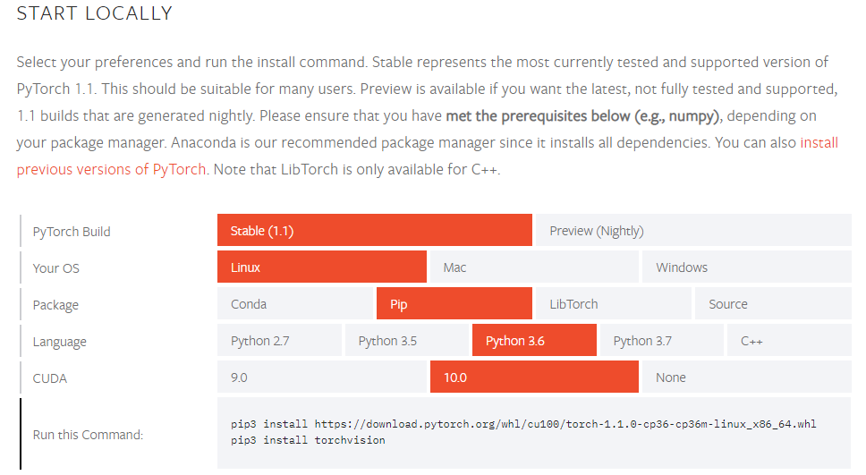

先说配置Nvidia TITAN X， CUDA10， CentOS 7.6， Python 3.6。本文涉及CentOS下Python的编译安装，Nvidia显卡驱动的安装，CUDA、cuDNN的安装以及PyTorch的安装。    
开始讲故事，这几天课题组的小伙子要用Pytorch进行深度学习计算，让我帮配置一下服务器的环境。我们的服务器是在一家叫云创的公司买的，之前没听说过，配备了一块Nvidia TITAN X显卡，安装的CentOS 7.6.  
半年前一个小伙子用TensorFlow来计算，我配置环境就费了好大力气。后来他久也不用，我们这边开发一顿折腾，环境已经用不起来了，这次使用PyTorch又是好几天来回折腾，终于成功了，这里记录一下。  
首先来到[PyTorch官网下载页面](https://pytorch.org/get-started/locally/)，选择系统版本、包管理器版本、Python版本和CUDA版本后，会给出一个安装命令。据说按照命令执行就可以安装PyTorch了。  

但是，并！没！有！我熟练地打开终端，进入Python3  
```python
import torch
torch.cuda.is_available()
```
结果嗖地一下，它就提示我False  
我检查了一下显卡的各项配置  
```shell
nvidia-smi
nvcc -V
```
都没有任何问题，能够正常输出。  
于是我在夜深人静开发人员都跑路的时候重启了服务器，因为我记得重启可以解决一切问题。但这次，正如我这三十来年的每一次表白一样，失败了。  
我卸载了pytorch，再重新安装比较老的一个版本  
```shell
sudo pip3 install https://download.pytorch.org/whl/cu100/torch-1.0.1.post2-cp36-cp36m-linux_x86_64.whl --no-cache-dir --proxy 192.168.0.100:1080
sudo pip3 install torch
```
看，我为了避免缓存的影响，特意使用了`--no-cache-dir`参数，还启用了我昂贵的立足美利坚的代理来加速下载。结果这次还是不行，证明了并不是下载的文件有问题。  
接下来，我又采用了卸载重装的办法，卸载了CUDA。  
```shell
sudo /usr/local/cuda/bin/uninstall_cuda_10.0.pl
```
再根据CUDA官方的[安装提示](https://docs.nvidia.com/cuda/cuda-installation-guide-linux/index.html)，下载二进制runfile并安装。发现安装中需要做一些选择，比如，是否安装驱动，是否安装OpenGL，是否配置XConfig等。我在后续的几次试验中反复安装、卸载、重新启动，这些排列组合都试过了，还是不行。  
再后来，我想到了，之前安装成功的一次，貌似是卸载了Python重新安装的。CentOS中默认没有Python3，我们之前是编译安装的。于是我进入到/usr/local中，删掉了python3.6的文件夹。再Down下来Python的源码，编译安装。  
```shell
tar -zxvf Python-3.6.8.tgz
cd Python-3.6.8
./configure --prefix=/usr/local/python3.6 --enable-optimizations
make
sudo make install
```
安装后又检查了一下`/etc/profile`中环境变量的配置，发现没有任何问题：  
```
#Set CUDA Environment By ZhangYJ
PATH=$PATH:/usr/local/cuda/bin
LD_LIBRARY_PATH=$LD_LIBRARY_PATH:/usr/local/cuda/lib64:/usr/local/cuda/extras/CUPTI/lib64
export CUDA_HOME=/usr/local/cuda
export PATH LD_LIBRARY_PATH

#Set Python3 Env By ZhangYJ
export PATH=$PATH:/usr/local/python3.6/bin
```
再次使用我昂贵的代理流量安装PyTorch，还是不行。  
这时候就开始瞎谷歌，因为各种依赖的版本较多，所以找起来并不是那么容易，我就一点点瞎试。其中有一个回答提示，除了`nvcc -V`之外，还可以使用CUDA带的一些Sample来测试CUDA安装是否成功。我进入到实例的deviceQuery目录中，`make`编译后运行`./deviceQuery`，发现竟然报错了。这是非常重要的提示，说明和PyTorch，和Python都没有任何关系，CUDA自己都玩儿不起来。  
我熟练得令人心疼地再次卸载CUDA，并卸载了Nvidia的驱动程序。  
```shell
sudo nvidia-uninstall
```
重启后，从Nvidia官网下载了新版的显卡驱动，准备安装。这里说明一下，我们的服务器并没有nouveau的驱动，平时也基本不用图形界面，但确实是由另一块显卡负责图形输出的。`lspci`查过发现，是一块名为MGA G200e的显卡，搜了一下据说是很老早的牌子。  
然并卵，重装了显卡驱动、CUDA后，仍然跑不过deviceQuery.这时候基本上网络上能搜索到的方法我都试验过了。一气之下，疯狂卸载，惊奇地发现，yum中居然安装了好多nvidia开头的包，估计是以前安装落下的。  
我就一点点地把yum中nvidia开头的、cuda开头的包全部卸载了。重新启动，直接安装CUDA。  
注意，这里我没有安装显卡驱动，而是直接安装CUDA，这种方法之前也试过，但是yum清理之后第一次尝试。CUDA安装时，选择安装显卡驱动，不安装OpenGL，不配置XConfig，安装Sample。安装成功之后，重新启动。再次编译deviceQuery，执行成功。再打开Python，发现torch也可以调用到CUDA了。  
最后是cuDNN的安装，这个没什么坑，直接按照[官方网站](https://docs.nvidia.com/deeplearning/sdk/cudnn-install/index.html)的说明撸就是了。  
```shell
tar -zxvf cudnn-10.0-linux-x64-v7.5.1.10.tgz
sudo cp cuda/include/cudnn.h /usr/local/cuda/include
sudo cp cuda/lib64/libcudnn* /usr/local/cuda/lib64
sudo chmod a+r /usr/local/cuda/include/cudnn.h /usr/local/cuda/lib64/libcudnn*
```
  
总结一下，这次绕了这么久主要是因为yum中有一些残留的其他版本的驱动和CUDA内容，全部卸载干净，直接安装CUDA就可以。熬了两天夜，终于搞定了，今天我真高兴←←  