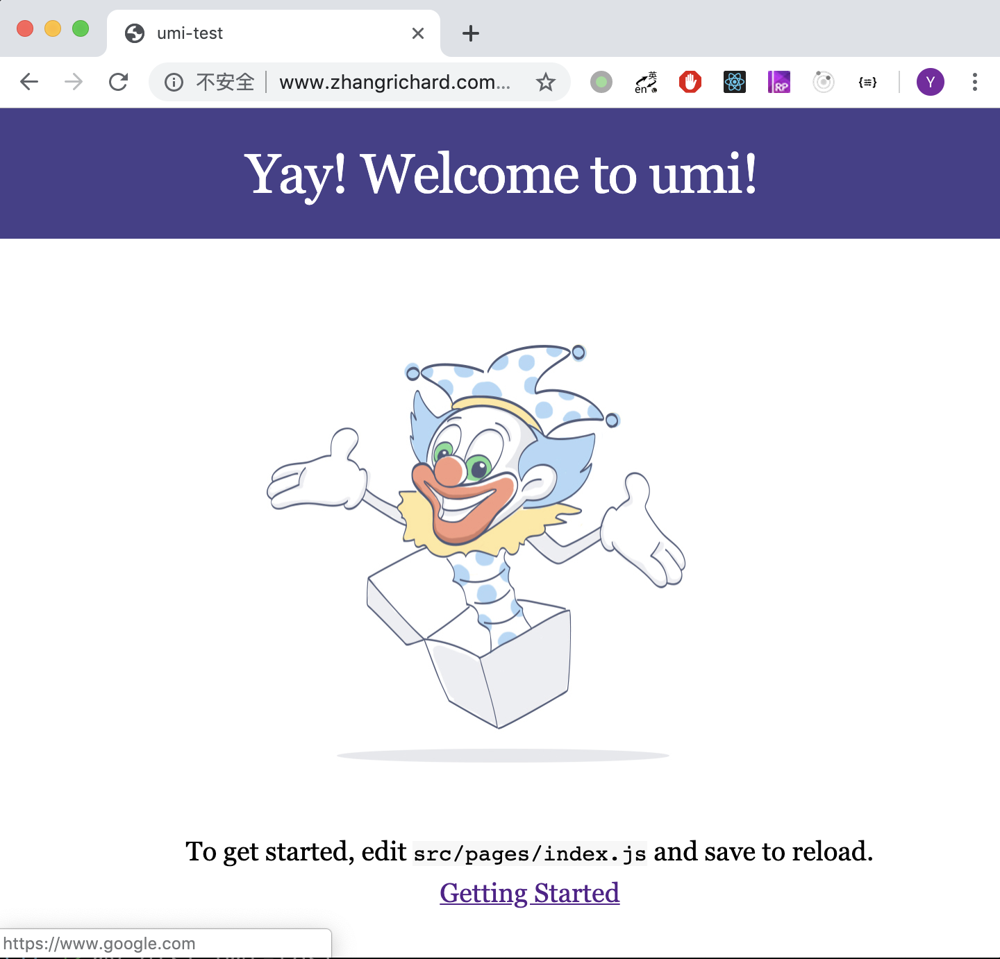

# 背景说明  
[umi](https://umijs.org/zh/)是一款React框架，由阿里前端团队开源，在我们最近的前端项目中，都使用umi。这里写一篇文章记录以下umi框架多环境打包的配置，以及配合Nginx部署到服务器上的一种做法。  
为演示流程，我们创建了一个新的umi工程，做法是新创建一个文件夹(我这里叫umi-test)，并通过官方提供的脚手架创建项目，并安装依赖及运行。  
```shell
mkdir umi-test
cd umi-test
yarn create umi
cnpm install
npm start
```
可以发现，随脚手架默认带了一个主页的例子。  
```javascript
import styles from './index.css';

export default function() {
  return (
    <div className={styles.normal}>
      <div className={styles.welcome} />
      <ul className={styles.list}>
        <li>To get started, edit <code>src/pages/index.js</code> and save to reload.</li>
        <li>
          <a href="https://umijs.org/guide/getting-started.html">
            Getting Started
          </a>
        </li>
      </ul>
    </div>
  );
}

```
我们直接在这个页面上修改。主要实现两个目标，一是根据不同的环境，设置不同的环境变量，这里以需要跳转的URL为例；二是打包并通过Nginx部署到某非根目录下。  

# 多环境的配置
我们考虑有dev和prod两种环境，前者用于npm start脚本的调试；后者用于npm run build打包后的线上运行。  
为设置环境配置，我们需要在`package.json`中的脚本行进行配置，考虑到多种操作系统不一致，我们使用cross-env工具。  
```shell
cnpm install cross-env --save-dev
```
之后就可以设置`package.json`中的脚本配置：  
```json
{
  ...
  "scripts": {
    "start": "cross-env API_ENV=dev umi dev",
    "build": "cross-env API_ENV=prod umi build",
    ...
  },
  ...
}
```
为了使配置能够传递到执行的代码中，需要在`.umirc.js`配置文件中加入如下配置：  
```javascript
...
define: {
  ...
    'process.env.API_ENV': process.env.API_ENV,
  },
...
```
最后，就可以在代码中直接获取配置了，如刚才的主页，我们修改链接地址可以这样使用：  
```javascript
import styles from './index.css';

export default function () {
  const url = process.env.API_ENV === 'prod' ?
    'https://www.google.com' : 'https://www.baidu.com';

  return (
    <div className={styles.normal}>
      <div className={styles.welcome} />
      <ul className={styles.list}>
        <li>To get started, edit <code>src/pages/index.js</code> and save to reload.</li>
        <li>
          <a href={url}>
            Getting Started
          </a>
        </li>
      </ul>
    </div>
  );
}

```
可以发现，现在用`npm start`运行时超链接指向百度，而使用`npm run build`打包后的静态文件中超链接指向谷歌。  
实际工程使用中，通常会封装一个获取BaseUrl的工具，在那里根据不同的配置给出不同的IP地址；再在各个service中调用该工具。  

# 部署到非跟路径
目前我们一个域名上有好多个工程，这样就需要将各个工程部署到非根路径下。这里，假设需要将我们的工程部署到[www.zhangrichard.com](http://www.zhangrichard.com)/umi-test中。  
umi工程的部署主要参考[官网中的指南]()，这里需要修改`.umirc.js`，增加如下两项配置：  
```javascript
{
  ...
  publicPath: './',
  base: '/umi-test',
  ...
}
```
其中`publicPath`配置项的作用是，设置编译后的各项静态资源的引用路径。如此设置后，`index.html`中对js和css的引用就设定为了`./umi.js`和`./umi.css`。这样，在部署时就可以将编译生成的html文件、js文件和css文件放置在同一目录中。  
`base`配置项的作用是说明工程在整个服务器中的相对位置，默认是根路径，如果需要部署到非根路径，就需要设置此项。这里我们设置为`/umi-test`。  
最后需要修改一下Nginx的配置文件。这里我将编译后的静态文件放置在`/home/zhang/static/umi-test`中，再在Nginx中添加如下配置：  
```conf
...
location /umi-test {
            alias /home/zhang/static/umi-test/;
}
...
```
# 效果
如此，我们访问线上的服务器就可以访问到打包的版本，可以看到，超链接的路径也被正确设置为了`prod`环境需要的谷歌。  
