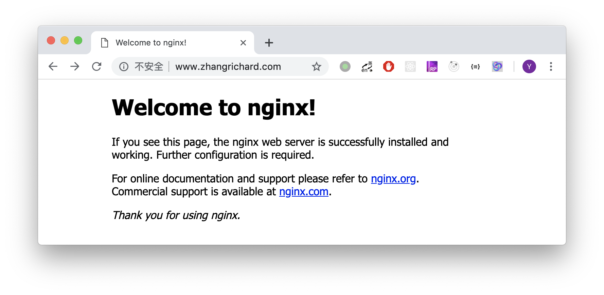
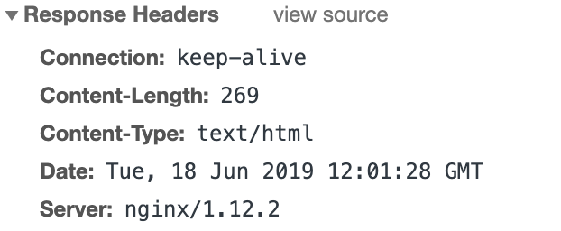

# Nginx的编译安装

## 背景说明
在之前，我的Nginx一直是通过包管理器进行安装。然而现在项目需要通过Nginx实现一个RTMP的服务器，以便在网页上实时查看监控视频，因此就需要在Nginx中添加一些其他的模块。搜索了一下，需要对Nginx进行编译安装。之前没试过，以为会比较麻烦，鼓捣了一上午，基本上走通了流程，这里记录一下。  
本文会涉及在CentOS7中通过yum进行Nginx的安装、卸载，Nginx源码的编译、安装等。  

## 通过yum安装Nginx
按照[官方文档](http://nginx.org/en/linux_packages.html#RHEL-CentOS)上面的说明，需要进行如下几步。  
首先安装一些依赖项：  
```shell
sudo yum install yum-utils
```
之后，设置仓库，需要创建`/etc/yum.repos.d/nginx.repo`文件，并填入以下内容：  
```
[nginx-stable]
name=nginx stable repo
baseurl=http://nginx.org/packages/centos/$releasever/$basearch/
gpgcheck=1
enabled=1
gpgkey=https://nginx.org/keys/nginx_signing.key

[nginx-mainline]
name=nginx mainline repo
baseurl=http://nginx.org/packages/mainline/centos/$releasever/$basearch/
gpgcheck=1
enabled=0
gpgkey=https://nginx.org/keys/nginx_signing.key
```
最后，使用`yum`安装即可：  
```shell
sudo yum update
sudo yum install nginx
```
安装期间，会提示是否倒入GPG key，选择是即可。  
安装成功后，需要启动Nginx，并将其设置成开机启动：  
```shell
sudo systemctl start nginx
sudo systemctl enable nginx
```
这时，访问我们的80端口，就可以显示出Nginx的欢迎页面。  


## 通过yum卸载Nginx
为了使用源码编译的Nginx，需要卸载包管理器安装的Nginx。首先停掉服务，之后是通过yum的卸载，接着要删除Nginx的仓库，最后刷新包管理器的缓存。  
```shell
sudo systemctl disable nginx
sudo systemctl stop nginx
sudo yum remove nginx
sudo rm /etc/yum.repos.d/nginx.repo
sudo yum clean all
sudo yum makecache
sudo yum update
```
现在通过yum安装的Nginx已经卸载干净了，相关的仓库也已经删除。再次访问我们的80端口，已经无法访问。  


## 源码编译安装Nginx
为了能够安装其他模块，我们需要通过源码来安装Nginx。首先到[官方网站](http://nginx.org/en/download.html)下载最新的源码安装包，并在本地解压。  
```shell
wget http://nginx.org/download/nginx-1.16.0.tar.gz
tar -zxvf nginx-1.16.0.tar.gz
cd nginx-1.16.0
```

### 修改Nginx的Server信息
在我们通过Nginx来访问时，Nginx会自动加入一个响应头，说明该服务器的信息。Server头信息对于用户和开发人员而言并没有太大意义，暴露该信息反而容易导致攻击者利用漏洞来进行攻击。  

这里我们将Server头设置成自定义的字段，用来装逼。  
需要修改`src/http/ngx_http_header_filter_module.c`，在大概49行（1.16.0版本）将ngx_http_server_string等之中的nginx，改为FanWebServer  
```C
static u_char ngx_http_server_string[] = "Server: FanWebServer" CRLF;
static u_char ngx_http_server_full_string[] = "Server: FanWebServer" NGINX_VER CRLF;
static u_char ngx_http_server_build_string[] = "Server: FanWebServer" NGINX_VER_BUILD CRLF;
```
再修改`src/core/nginx.h`中相关的版本号：  
```C
#define NGINX_VERSION "DiaoBao"
#define NGINX_VER     "FanWebServer/" NGINX_VERSION
```

### 第三方库的引入
这里我们以需要的[nginx-http-flv-module](https://github.com/winshining/nginx-http-flv-module)为例。所做的只是将源码克隆到本地，再在Configure时加入`--add-module=/path/to/nginx-http-flv-module`即可。  
```shell
git clone https://github.com/winshining/nginx-http-flv-module.git
```

### 编译安装
首先需要确保安装了编译需要的一些依赖：  
```shell
yum install gcc pcre pcre-devel zlib zlib-devel openssl openssl-devel
```
从源码编译安装的套路就是configure、make、make install一条龙。在configure时，[官方网站](http://nginx.org/en/docs/configure.html)提供了一系列参数的解释，我们使用了以下的几个：  
```shell
./configure \ 
--user=root \
--prefix=/usr/local/nginx \
--with-http_ssl_module \
--with-http_stub_status_module \
--with-http_realip_module \
--with-threads \
--add-module=./nginx-http-flv-module
```
在执行完毕后，会收到一份总结，给出编译安装后，的各种真实配置：  
```shell
Configuration summary
  + using threads
  + using system PCRE library
  + using system OpenSSL library
  + using system zlib library

  nginx path prefix: "/usr/local/nginx"
  nginx binary file: "/usr/local/nginx/sbin/nginx"
  nginx modules path: "/usr/local/nginx/modules"
  nginx configuration prefix: "/usr/local/nginx/conf"
  nginx configuration file: "/usr/local/nginx/conf/nginx.conf"
  nginx pid file: "/usr/local/nginx/logs/nginx.pid"
  nginx error log file: "/usr/local/nginx/logs/error.log"
  nginx http access log file: "/usr/local/nginx/logs/access.log"
  nginx http client request body temporary files: "client_body_temp"
  nginx http proxy temporary files: "proxy_temp"
  nginx http fastcgi temporary files: "fastcgi_temp"
  nginx http uwsgi temporary files: "uwsgi_temp"
  nginx http scgi temporary files: "scgi_temp"
```
接着就是`make`编译和`sudo make install`安装。速度很快，在我的破搬瓦工主机上，一首《那些花儿》才唱到“她们已经被风吹走，散落在天涯”。  
这时我们的编译结果已经拷贝到了`/usr/local/nginx`，需要设置软连接以便直接通过命令访问。  
```shell
sudo ln -s /usr/local/nginx/sbin/nginx /usr/bin/nginx
```
接着需要写一个文件，以便将Nginx作为一个服务。CentOS7使用systemd，因此要生成`/lib/systemd/system/nginx.service`  
```service
[Unit]
Description=nginx
After=network.target

[Service]
Type=forking
ExecStart=/usr/local/nginx/sbin/nginx
ExecReload=/usr/local/nginx/sbin/nginx -s reload
ExecStop=/usr/local/nginx/sbin/nginx -s quit
PrivateTmp=true

[Install]
WantedBy=multi-user.target
```
接着，就可以启动nginx服务，并将其设置为开机启动：  
```shell
sudo systemctl start nginx
sudo systemctl enable nginx
```
最后，如果需要配置Nginx，记得配置文件位于`/usr/local/nginx/conf/nginx.conf`  
再次访问80端口，发现已经Nginx已经正确地启动，并且Server头也改成了我们的`FanWebServer/DiaoBao`

## 踩坑
最开始我试着先不卸载yum安装的Nginx，只是编译并安装到其他路径中，并设置`--conf-path`指向现有到配置文件，最后修改service文件指向新的路径。这么做的好处是可以保持配置文件不变，而且切换耗时比较短，基本上不影响同事们的工作。  
可惜yum安装Nginx时默认带上了几个动态模块，这些模块必须与源码安装的版本相同，且必须重新编译。否则在Nginx test时就会报错，无法启动。  
这里有两个解决方案，一个就是像上面提到的一样，yum卸载，再源码安装；另一个方法，就是直接在`nginx.conf`配置文件中和谐掉这些模块（因为我源码编译也没带着他们，暂时不知道是干甚的）。如果确实是有需要的动态模块，就只能老老实实地卸载重新编译了。  
这里记录一下。  