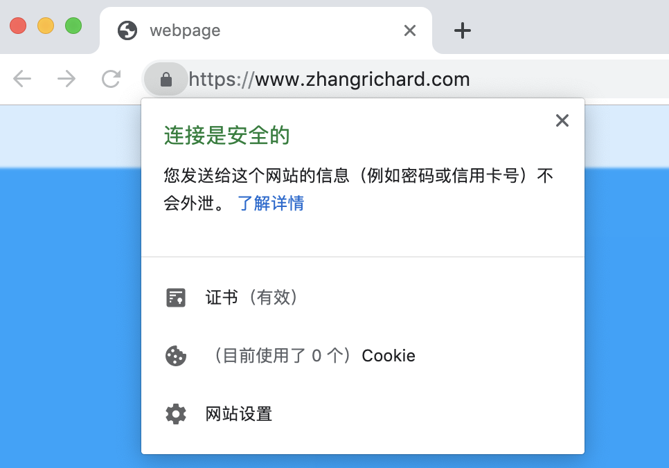

# HTTPS升级记录
公司的官方网站马上上线了，之前一直是用Nginx作反向代理，监听80端口，现在看着浏览器上的“不安全”三个字越来越不爽，就拿自己的破网站做实验，尝试着使用HTTPS来访问。  

## 证书准备
HTTPS的好处和原理之类的，这里就不说了，只需要知道，我们需要一个证书，这个证书可以证明在访问我域名的网站时确实就是在访问我域名的网站。（说实话，派出所都开不出这个证明……）  
HTTPS的证书一般都很贵，而[据阮一峰大神所说](http://www.ruanyifeng.com/blog/2016/08/migrate-from-http-to-https.html)为了推广HTTPS协议，电子前哨基金会EFF成立了[Let's Encrypt](https://letsencrypt.org/)，提供免费证书，我自己破网站上当然选择的就是这款了。  
Let's Encrypt安利我们使用`Certbot`工具来进行证书的管理。在CentOS7上，需要首先安装`epel`仓库。  
```shell
sudo yum install epel-release
sudo yum update
sudo yum install certbot
```
之后，使用Certbot工具来获取证书。Certbot获取证书有好多种方法，貌似有的方法还可以直接帮助你修改Nginx配置文件。不过我感觉有点虚，还是手动档吧，只获取证书，再手动进行配置。  
这里，我为`www.zhangrichard.com`和`zhangrichard.com`两个域名申请证书（没错，要写两个）。  
```shell
sudo certbot certonly --standalone -d zhangrichard.com -d www.zhangrichard.com
```
Certbot是一个交互式的程序，首先要求你给出邮箱地址，便于接受通知邮件等；接着问你是否同意协议，自然是同意了；再之后会问你是否愿意分享邮箱地址，这里应该是会发宣传广告之类的，可以选择否，我就没有同意分享。  
一顿Yes/No之后，Certbot会后台验证，看你给出的两个域名（我们这里是`www.zhangrichard.com`和`zhangrichard.com`是否真正指向当前的机器，几秒过后就可以验证通过。之后就是恭喜你如何如何的，并建议你备份自己的证书，默认情况下，一些文件会放置在`/etc/letsencrypt/live/xxxx.com/`路径中。  
到此，我们已经获得了证书。  

## Nginx配置
首先要明确，HTTP协议默认是走80端口，而HTTPS协议默认是走443端口。  
打开Nginx配置文件，找到之前网站的`server`部分，将80改为443，再补充证书相关信息即可。  
```conf
server {
  # 这里两个listen改为443 ssl
  listen 443 ssl;
  listen [::]:443 ssl ipv6only=on;
  server_name zhangrichard.com www.zhangrichard.com;

  root /my/root/path/;

  include /etc/nginx/default.d/*.conf;

  # 这里三个ssl相关配置，需要给定证书路径中的各文件
  ssl_certificate /etc/letsencrypt/live/xxx.com/fullchain.pem;
  ssl_certificate_key /etc/letsencrypt/live/xxx.com/privkey.pem;
  ssl_trusted_certificate /etc/letsencrypt/live/xxx.com/chain.pem;
}
```
这时，打开浏览器，通过`https://www.zhangrichard.com`进行访问，就可以看到小锁头，显示我们的访问是安全的。激动一刚。  
  
再试一下不指定https，直接输入网址，这时默认是通过HTTP协议。发现访问不了了！  
吓尿过后仔细想一想就明白了，刚才我们把Nginx配置中监听80端口的部分都改成监听443了，就不会再监听80端口，自然访问不了了。  
根据我们往常的经验，访问别人家的网站时，并不需要手动指定协议，只是输入域名就可以，而且会自动切换到HTTPS的网站。我们也要实现这种功能!  
  
实现有很多种办法，这里我们使用最简单的，再写一段Nginx的配置，监听80端口，将收到的请求直接rewrite，转向443端口。  
```conf
server {
  listen 80;
  server_name zhangrichard.com www.zhangrichard.com;
  rewrite ^(.*)$ https://$host$1 permanent;
}
```
再次直接通过域名访问我们的网站，发现已经自动转到HTTPS上了。  

## 证书续命
终于整上了HTTPS，很高兴，看着浏览器上自己的网站越来越喜欢，就一顿瞎点。发现证书还有不到三个月就要过期了，纳尼！搜了一下，原来Let's Encrypt的证书有效期只有90天，要不断续命才行。  
咋整？续呗，咱也是膜蛤一族，续命，咱是专业的。  
  
根据[Certbot网站](https://certbot.eff.org/docs/using.html?highlight=renew#renewing-certificates)上所说，使用`certbot renew`命令可以更新距过期30日之内的所有证书。我们只需要使用Linux的定时任务`crontab`就可以自动续命了。  
```shell
sudo crontab -e
```
并在文件中加入一行（根据我的日期推断，每月15号尝试续一次是比较合适的，大家可以灵活处理）:  
```
0 0 15 * * certbot renew
```
好了，现在每个月计算机都会自动进行续命，真是too simple。  

## 踩坑
写得简单，实际自己操作的时候还是踩了点坑的。  
### 无法安装Certbot
之前提到，使用yum安装certbot需要首先安装epel库。可是在我的破VPS上，`sudo yum install certbot`一直提示没有这个包！我反复确认了自己的拼写没有错误，epel库也安装了。一开始我怀疑是网络不给力（因为在办公室的服务器上yum不给力），后来想到，不可能，我的破VPS是立足美利坚，网络好得一逼。  
我一顿谷歌，终于在Gayhub上，发现了[一个穿格子衫发际线极高的男子的言论](https://github.com/certbot/certbot/issues/3257#issuecomment-231219540)，彻底删除epel库，刷新缓存后重新安装，果然就有了！  
### 无法获取证书
如上，我是使用手动档获取证书的。一开始执行完命令后，我发现自己的`/etc/letsencrypt`路径下并没有`live`文件夹。反复试了几次也是没有，我甚至怀疑是不是自己参考的文档都过时了，新版本的certbot并不是生成在这里。  
后来又谷歌了半天，发现在获取证书时，certbot会在后台进行验证，需要开放80端口，而之前我Nginx一直在运行，霸占着80端口，因此验证失败。我试着停掉Nginx服务后重新获取证书，果然就成功了。  
### Certbot运行时失败
这是在今天部署公司官网时发生的，用的是阿里云的CentOS7. 安装都很正常，不过在运行时报错，提示`ImportError: No module named urllib3`。  
我一看，这是Python的报错啊，而且根据堆栈信息，是Python2的报错。我使用pip安装了一下urllib3，再次运行，好，这次提示我版本不行，它要求urllib3的版本>=1.21.1且<1.23.幸亏我们现在已经不使用Python2了，随便我折腾，便又将其降级，到1.21.1，这次就好使了。  
```shell
sudo pip install --upgrade --force-reinstall 'urllib3==1.21.1'
```