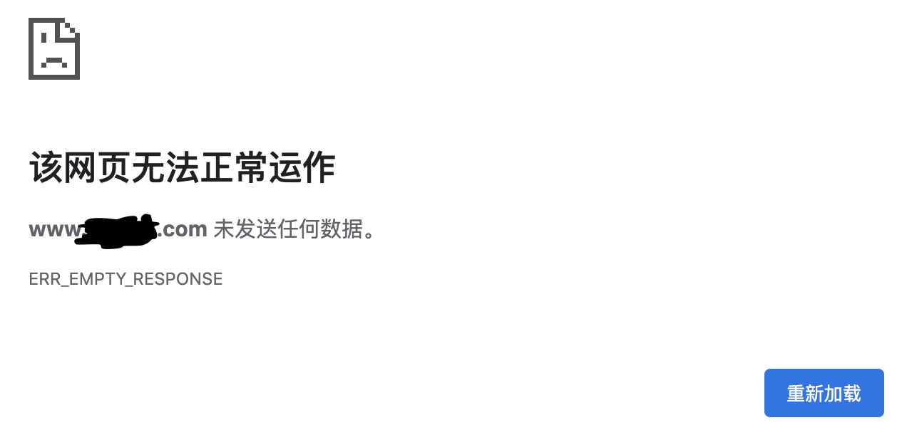

# 问题描述
我一般使用Google作为搜索引擎，也偶尔的使用百度都是用一些特别的快捷功能，比如搜快递、搜农历、搜本机IP等。  
前两天单位的同事突然问我，公司的官网是哪个。我们这种小公司，官网纯粹是宣传性质的几个页面，搞上去之后自己都不会去看，问出这种问题自然不会奇怪。只是他说，现在百度搜公司名字，能搜到一个很奇怪的域名。  
我百度了一哈，果然是，点进去提示我证书有问题（这是因为在之前我对官网进行了设置，自动跳转到HTTPS访问，域名不对到话就会提示）。我仍然点进去看，发现了一个和我们公司官网一样到网站。  
我好奇地ping了一下这个域名，发现就是指向我们公司到主机IP。我很好奇，这是几个意思呢？Whois搜了一下，居然还是在阿里云注册的域名，这就更奇怪了，要知道，现在在阿里云注册.com域名是要实名认证的，怎么会有人拿阿里云注册的域名来绑我们的IP呢。  
# 恶意绑定的危害
我上网搜了搜，又看了会儿逼乎上年薪百万大佬们的回答，学习到了，这种情况叫做恶意绑定或域名恶意解析。危害说大不大，说小也不小，就是会导致流量被劫持到其他域名，降低搜索引擎中的排名，这点我们倒是不担心，公司官网八百年都没有别人看一次，基本都是通过名片自己输的。另外一种危害比较难受，是由于对方的域名未备案，政府发现了，就把我们主机给封掉了。要知道，国内备个案还是挺费劲的，官老爷们办事效率确实不高，要是被这么搞一发，确实很难受。所以我们还是要对这种情况处理一哈，防止别人瞎绑。  
# Nginx中的设置
在Nginx中，解决这个问题非常简单，只需要写一个空主机名的配置就可以。我们的Nginx顶在最前面，有多个虚拟主机，每一个都有一个或几个`server_name`，在通过不同域名对主机进行访问时，就根据这些主机名来读取不同的配置。如果每一种配置都无法匹配，则会使用空主机名的配置。  
我们在空主机名的配置段中，有多种处理方法，比如可以返回500/403，或重定向到正确的域名，或者使用一个非标准但是广泛使用的状态码444。按照[维基百科](https://zh.wikipedia.org/wiki/HTTP状态码)中的说法，该状态码表示“服务器不向客户端返回任何信息，并关闭连接（有助于阻止恶意软件）”。  
返回500或者403，可能导致通过搜索引擎（特别是傻逼百度）搜索到我们公司网站到中老年领导误以为官网挂球了；重定向的话，还是存在备案被和谐的情况；444虽然也是看起来一片白，好在一般浏览器会给出提示，稍微能说得过去一点。权衡一下，决定返回444。我们的网站正常是通过HTTPS访问的，因此像下面这么写  
```
server {
    listen       80 default_server;
    server_name  _;
    return       444;
}
server {
    listen       443 default_server;
    server_name  _;
    return       444;
}
```
保存后reload一下Nginx配置，发现通过其他的域名已经无法正常访问我们的网站了，很好。我又通过我们正确的域名访问，居然也不好使了，纳尼！  
一顿搜索后，发现，即使是这种处理“非正常”请求的区段，也要按照正经的玩儿法去写，我们之前的错误在于监听HTTPS的端口没有给出证书相关信息。仿照之前正确的区段，改成如下这般：  
```
server {
    listen       80 default_server;
    server_name  _;
    return       444;
}
server {
    listen       443 default_server;
    server_name  _;

    ssl_certificate /etc/letsencrypt/live/xxx.com/fullchain.pem;
    ssl_certificate_key /etc/letsencrypt/live/xxx.com/privkey.pem;
    ssl_trusted_certificate /etc/letsencrypt/live/xxx.com/chain.pem;

    return       444;
}
```
再reload一下配置，现在完全OK了，通过其他域名无法正常访问我们的网站，通过正确的域名则没有任何影响。  
  

# 后记，我是傻逼
晚上回到家里，我还是在合计，怎么会有人傻到用阿里云的域名来绑别人的IP，这个到时候真要查，跑都跑不了。  
后来晚上在蹲坑拉翔的时候突然想到，那是我们另一个项目我买的域名，网站的建设暂时搁置了，我就临时绑到了现有的主机上！原来，我就是那个傻逼。捂脸……  