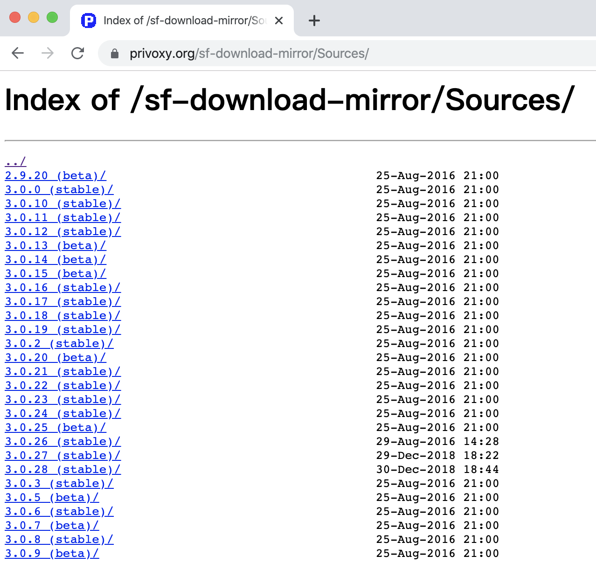

# CentOS 7 科学上网配置

## 背景

科学上网么，大家都懂的。作为一个有追求的程序员、自诩为的知识分子，总要上网检索一些资料，观看影片陶冶情操之类的，这时候就需要科学上网了。  
我在 California 有一台 VPS，正所谓立足美利坚，服务全球华人。之前在我的各种台式机、笔记本上都使用小飞机来进行科学上网，现在有了新的需求，他们要求在公司的服务器上也能够进行科学上网操作  
其实这个事儿本来很简单，因为我一般都在办公室，想要干什么直接就把代理设置成我电脑小飞机的地址了。不过现在我不太想加班，想多点时间去追妹子，所以就得保证服务器上也有科学上网环境，这样我不在他们也能自己玩儿。（虽然很少出现别人加班我不在的情况，贼鸡儿惨……）  
作为 ~~技术总监~~ 网管，我就大周末的来公司配环境，这里墨迹墨迹，并把过程和坑记录一下。

## 总体思路

需要安装 Shadowsocks 客户端，用于连接立足美利坚的服务器；另外需要安装 Privoxy，用于将其他的协议转换为 ss 协议，转发给 Shadowsocks。  
我失败了几次，都是因为 Privoxy 没有安装，现象就是明明 Shadowsocks 客户端跑的好好地，可用作代理就是不行。因为不管 Windows 还是 Mac 上的小飞机都是集成了 Privoxy 的，我就以为只安装一个 Shadowsocks 就可以呢。看网上好多还装这个的，以为他们是那种互相抄的博客（虽然也确实不少）；后来仔细想了一下，每次装系统后第一次启动小飞机都会有两次程序联网确认，一次是 Shadowsocks 的，一次是 Privoxy 的。于是我试着安装了一下，果然就可以了。  
朋友们，这个故事告诉我们，经常给女同事装操作系统还是有一定帮助的，只要细心观察，生活处处都是经验，捂脸。

## Shadowsocks 客户端的安装与配置

Shadowsocks 客户端使用 pip 就可以安装。至于怎么安装 pip，我这里假定没有人看我的文章，只是自己备忘，要是 pip 都不会安装了，我就可以下岗了。

```shell
sudo pip install shadowsocks
which sslocal
```

安装后，可以发现，二进制文件位于`/usr/bin/sslocal`。  
接下来我们需要编写配置文件，配置服务端的地址、端口、连接密码，本地服务绑定地址、端口等。这个文件其实放在哪都可以，我就放在/etc/shadowsocks.json，我配置了监听本地 1081 端口。

```json
{
  "server": "xxx.xxx.xxx.xxx",
  "server_port": 10086,
  "password": "C'est the mima",
  "local_address": "127.0.0.1",
  "local_port": 1081,
  "method": "aes-256-cfb",
  "timeout": 300,
  "workers": 1
}
```

为了偷懒，应该将 Shadowsocks 设置成一个服务，并让其开机自动启动。在`/usr/lib/systemd/system/`目录中加入 shadowsocks.service，并配置其内容，在这里，需要指定启动时使用的配置脚本，也就是上面我们写的那个 json 配置文件的地址。

```service
[Unit]
Description=Shadowsocks
[Service]
TimeoutStartSec=0
ExecStart=/usr/bin/sslocal -c /etc/shadowsocks.json
[Install]
WantedBy=multi-user.target
```

最后，尝试将服务加入自动启动并启动服务，可以通过 curl 一下来验证，如果启动成功，会返回一个带有`origin`字段的 json

```shell
sudo systemctl enable shadowsocks
sudo systemctl start shadowsocks
curl --socks5 127.0.0.1:1081 http://httpbin.org/ip
```

在完成了 Shadowsocks 的安装后，局域网中的 Windows 和 Mac 机器就可以不再使用小飞机，直接在浏览器上装一个 SwitchyOmega，将切换规则的代理服务器设置为服务器地址和端口，协议选择 SOCKS5 就可以了。

### 配置 Shadowsocks 过程中的坑

在配置文件`shadowsocks.json`中，我一开始从网上找的配置有一行是`"fast_open": true`，会导致服务启动失败，把这行干掉了就好了。  
我搜索了一下，如果开启这个需要 3.7+的 Linux 内核，而且是客户端和服务端都开启。具体做法是在内核参数配置文件`/etc/sysctl.cnf`中加入`net.ipv4.tcp_fastopen=3`。考虑到现在上网速度可以接受，且服务端跑的好好地，就不再折腾了，这里记录下来有这个地方可以优化。

## Privoxy 的安装配置

如果希望局域网中的其他机器通过 HTTP 协议跑代理，或者服务器本身跑非 SS 协议的代理，就需要使用 Privoxy。它的作用是在访问端和 Shadowsocks 客户端中间加一层，将其他协议转换为 SS 协议，再通过 Shadowsocks 客户端发送给服务端。  
网上找的方法是通过`yum`来直接安装，不过我`yum`中搜索不到，就索性使用源码编译安装了。  
在官网[privoxy.org](https://privoxy.org)中可以找到源码下载地址以及编译安装的文档，照着撸就好。  
有一个小坑是，这个官网貌似也是被墙的，我是在自己 Windows 的机器上通过小飞机下下来，然后把`tar.gz`源码包拖到服务器里的。

```shell
tar zxvf privoxy-x.x.x-stable-src.tar.gz
cd privoxy-x.x.x-stable
autoheader
autoconf
./configure --prefix=/usr/local/privoxy
make
sudo make install
```

安装后的所有东西都位于`/usr/local/privoxy`路径下，我们需要编辑其配置文件`/usr/local/privoxy/etc/config`，确保有以下两行配置，用于监听本地 1080 端口，并转发到 1081 端口，也就是之前开启的 Shadowsocks 端口。（注意第二行配置的最后有一个小点）

```config
listen-address 0.0.0.0:1080
forward-socks5t / 127.0.0.1:1081 .
```

根据官网的建议，尽量不要通过 root 身份来启动 Privoxy，建议建立一个专门的 privoxy 账号

```shell
sudo useradd privoxy
```

仍然，我们需要将 Privoxy 设置成一个服务，并开机自动启动。编辑`/usr/lib/systemd/system/privoxy.service`

```service
[Unit]
Description=Privoxy
[Service]
Type=forking
PIDFile=/run/privoxy.pid
ExecStart=/usr/local/privoxy/sbin/privoxy --user privoxy --pidfile /run/privoxy.pid /usr/local/privoxy/etc/config
[Install]
WantedBy=multi-user.target
```

之后将服务加入自动启动，并开启服务：

```shell
sudo systemctl enable privoxy.service
sudo systemctl start privoxy.service
```

现在就可以在局域网其他机器的浏览器中使用 HTTP 方式连接到 Privoxy 的代理端口 1080 了。同时，服务器本身也可以使用代理来进行 wget 或是 pip 等操作。

### 配置 Privoxy 过程中的坑

第一次我下载源码包，编译安装后，发现无法设置 socks5 代理，配置文件的示例中也只是有 socks4 的。我就上网搜索了一下，有一个老外提到可能是版本过老。我回想了一下，自己是从官网下载的，应该不会有这种问题啊。于是我又检查了一下下载的那个网页，嗯，原来我只顾着找最后一个 stable 版本，没注意他的这个排序方法……好吧，我以后再认真一点  

