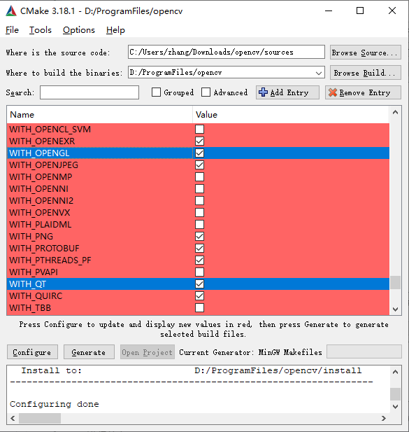
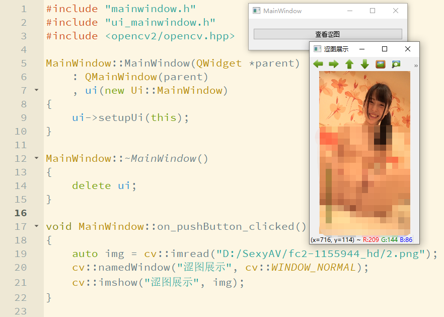

# Win10中Qt集成OpenCV

## 背景
在做的一个项目客户希望在Windows主机上连接USB摄像头，并通过界面、网络来进行双重控制。考虑到网络库和桌面环境的集成，选择了使用Qt进行C++编程（当然，Windows里C#是坠吼的，正好为了练习C++，就选了Qt）。  
Qt本身提供了QCamera，不过貌似功能不太给力，又不想直接调用那堆Win32的API，就选择了集成OpenCV。这里记录一下Win10下Qt集成OpenCV的配置过程。  
如果是使用VS编译器，就可以直接使用OpenCV官方预编译的版本了。不过我这里是用的Qt 5.12.9及MinGW编译器，因此需要在Windows中使用MinGW编译OpenCV。  

## OpenCV的编译
Windows下使用MinGW编译OpenCV，需要使用CMake。  
<b>需要注意的是，在配置过程中，可能会产生一些社会主义特色的网络连接问题，因此建议使用一些特别的方式打开CMake GUI。打开cmd，设置代理，并启动CMake GUI，这样在配置过程中就可以使用代理了。</b>这里，我本机已经配置好了1080端口的http代理，具体如何操作请自行谷歌。  
```cmd
set http_proxy=http://127.0.0.1:1080
set https_proxy=http://127.0.0.1:1080
cd "C:\Program Files\CMake\bin"
cmake-gui.exe
```
打开CMake GUI，首先指定源码路径以及希望生成编译工程的地址，并点击Configure。  
  
在弹出的配置选项中，指定生成结果为MinGW MakeFiles，并将编译器手动指定为Qt中安装的版本，最后点击Finish进行首次Configure  
  
  
首次Configure后，我们需要指定编译选项。在原有选项的基础上，额外再选择`WITH_OPENGL`和`WITH_QT`，再次点击Configure。  
  
又跑了一阵，多了一些Qt相关的选项，默认的没啥问题，直接再点击Configure进行配置。  
  
这次配置完之后，已经没有红色的问题了，可以点击Generate，生成我们需要的MakeFiles。  
  
生成结束后，CMake就可以关闭了。我们进入到生成的文件夹中，在命令行中打开，并直接运行`mingw32-make.exe`进行编译（这里，我已经加好了环境变量，如果没有加过，可以使用Qt中的全路径）。  
编译比较慢，可以趁机撸一发。而且进行到40%左右时，我这里提示了一个编译错误：  
```
gcc: error: long: No such file or directory
D:\ProgramFiles\MinGW\mingw64\bin\windres.exe: preprocessing failed.
mingw32-make[2]: *** [modules\core\CMakeFiles\opencv_core.dir\build.make:1494: modules/core/CMakeFiles/opencv_core.dir/vs_version.rc.obj] Error 1
mingw32-make[1]: *** [CMakeFiles\Makefile2:1930: modules/core/CMakeFiles/opencv_core.dir/all] Error 2
mingw32-make: *** [Makefile:181: all] Error 2
```
网上很容易查到解决方案，就是参考MakeFile中的指令，稍微改一点，手动把这个编过去。参考的指令上面报错信息已经很清楚，在第几行都告诉我们了。稍微改一下，改成这样之后在新窗口中执行一下：  
```
D:\ProgramFiles\MinGW\mingw64\bin\windres.exe  D:\ProgramFiles\opencv\modules\core\vs_version.rc -O coff CMakeFiles\opencv_core.dir\vs_version.rc.obj
```
执行后再次在原编译窗口内运行`mingw32-make.exe`，会自动继续编译。这次时间更长，可以撸两发。撸好回来发现已经编译成功了。接下来运行`mingw32-make.exe install`进行安装，编译的结果就整理在当前目录的install子目录中。  

## 编译踩坑
编译的过程踩了点坑，这里记录一下。  
第一个就是之前说的，编译过程中提示`gcc: error: long: No such file or directory`，已经解决。  
第二个坑是在写博客这台电脑上发现的。这台电脑上，我安装过MinGW，并设置过PATH，结果在Configure过程中，就把一些指令用系统环境的相关工具实现了，并没有用Qt中的相关工具，导致编译到后期会有报错。解决方法就是先删掉PATH中MinGW相关内容，并把Qt下MinGW相关路径加入PATH。  
第三个坑是和第二个同时发现的。在这台电脑上，安装过Anaconda，Configure过程中没注意，Qt相关路径是找到了Anaconda中的路径（事实上，上面的配图中就是这样）。这里要修改成真正Qt相关的路径，再进行Configure。  

## OpenCV环境配置
编译完成后，需要进行一些简单的配置。  
首先，我将install中的编译结果完全复制到了D:/ProgramFiles/opencv中。之后，又将其中的`x64\mingw\bin`路径添加到了PATH中，这样，调用OpenCV的程序在运行时就可以加载起来。  

## 编译的验证
在Qt中创建一个新的项目，并在pro配置文件中补充OpenCV相关的INCLUDE和LIB。（我已经把之前install中的内容复制到D:/ProgramFiles/opencv中了，请酌情替换）  
```
INCLUDEPATH += D:/ProgramFiles/opencv/include

LIBS += D:/ProgramFiles/opencv/x64/mingw/lib/libopencv_*.a
```
我在窗口中只加了一个按钮，点击按钮时通过OpenCV读取磁盘上的图片并展示，程序正常运行，说明OpenCV的编译和集成都没有问题，验证完成。  
窗体实现类代码和运行效果如下  
```C++
#include "mainwindow.h"
#include "ui_mainwindow.h"
#include <opencv2/opencv.hpp>

MainWindow::MainWindow(QWidget *parent)
    : QMainWindow(parent)
    , ui(new Ui::MainWindow)
{
    ui->setupUi(this);
}

MainWindow::~MainWindow()
{
    delete ui;
}


void MainWindow::on_pushButton_clicked()
{
    auto img = cv::imread("D:/SexyAV/fc2-1155944_hd/2.png");
    cv::namedWindow("涩图展示", cv::WINDOW_NORMAL);
    cv::imshow("涩图展示", img);
}
```
这是程序运行截图，可以看到，我已经尽力打了马赛克。不过不知道为什么，我看小图的时候感觉并没有马赛克，难道这就是所谓的心中无码境界么，捂脸。  
