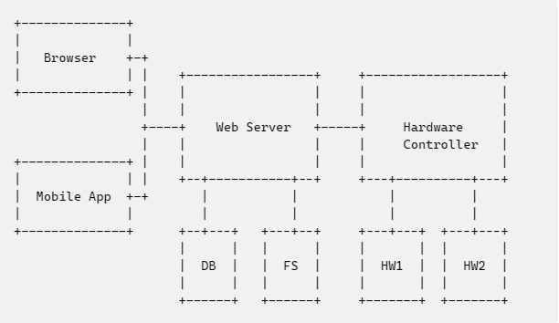

# C#独立 HTTP 服务端

## 背景

项目上需要通过网页和 APP 进行某些硬件的数据采集和控制，硬件提供了 C++和.Net 的 SDK。

考虑到开发人员的技术熟练程度，设计了以下总体结构：浏览器和 APP 通过 API 与后端服务（Java）进行通信，后端服务再通过 HTTP 与硬件控制程序（C#）程序进行通信。这样，后端开发人员可以使用熟悉的框架进行 Web 服务编写、数据库和文件系统读写；上位机程序员编写硬件控制程序，并集成 HTTP 服务，用来进行硬件相关数据读写。

上一版本的程序使用裸 TCP 协议进行上 C#程序与 Java 程序的通信，但随着功能需求的增加，继续使用 TCP 协议较为复杂；另一方面，如果使用 WebSocket 进行全双工通信，Java 程序还要处理异步的响应，也比较麻烦，因此最后选择使用 HTTP 服务的方法，Java 程序和 C#程序分别监听一个端口，通过约定的 API 进行通信。（或许后续可以改为使用 MQ？不过这样会引入中间件，对于小规模项目反而会变得复杂）



# 在.NET Framework 程序中监听 HTTP 请求

一般地，使用 C#监听 HTTP 请求都需要使用 IIS 服务。对于简单的项目来说，再配置 IIS 比较复杂，因此我们需要找到一种办法，在一般地.NET Framework 程序中开启 HTTP 服务。

[微软教程](https://learn.microsoft.com/en-us/aspnet/web-api/overview/hosting-aspnet-web-api/use-owin-to-self-host-web-api)中介绍了一种方法，使用`Microsoft.AspNet.WebApi.OwinSelfHost`包，即可创建`Self-Host`的 Web 服务。

## 安装软件包

具体地，首先需要在 NuGet 包管理器中搜索`Microsoft.AspNet.WebApi.OwinSelfHost`，在包的介绍中也可以看到，可以通过这个包来在自己的进程中使用`OWIN HttpListener`.

## 定义 Controller

Controller 类用于处理 HTTP 请求，能够解析请求体，并发送响应。以下为示例，定义了一个名为`MyController`的类，包含一个`HandlePost`方法，其中的`MyRequest`和`MyResponse`类是根据 API 文档定义的类型。

需要注意的是，类名字应该为 `XXXController`，便于后续的路由匹配。

```C#
namespace HttpServer
{
  public class MyController : ApiController
  {
    [HttpPost]
    public MyResponse HandlePost([FromBody]MyRequest request)
    {
      Console.WriteLine(request);
      MyResponse response = new MyResponse();
      return response
    }
  }
}
```

## 配置服务端

定义了若干个`Controller`类之后，需要进行服务端配置，进行路由绑定，也即针对不同的请求，分配到指定的`Controller`中的指定方法中。

以下是针对上述的`MyController`进行配置，注意其中的`controller`字段，只取上述`Controller`类名中的`XXX`部分，框架会自动组装出正确的类名。

```C#
namespace HttpServer
{
  class MyServer
  {
    public void Configuration(IAppBuilder appBuilder)
    {
      HttpConfiguration config = new HttpConfiguration();
      config.Routes.MapHttpRoute(name: "DefaultApi",
        routeTemplate: "api/xxx/hardware",
        defaults: new { controller = "My", action = "HandlePost" }
      );

      appBuilder.UseWebApi(config);
    }
  }
}
```

## 启动服务

编写了服务配置后，需要启动服务。这里我直接写在了`Main`函数中，在启动时，需要指定监听的 IP 和端口。

（值得注意的是，我可以监听`127.0.0.1`，但本机的其他网卡地址并没有监听成功，也无法监听`0.0.0.0`，这个问题目前还未解决）

```C#
string baseAddress = "http://127.0.0.1:9000/";
using (WebApp.Start<MyServer>(url: baseAddress))
{
  while (true)
  {
    Console.ReadLine();
  }
}
```
