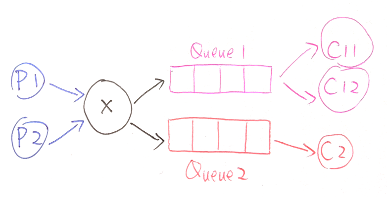

# RabbitMQ 基本概念及使用

## 背景

在项目中，使用 RabbitMQ 作为物联网数据在各服务间传递的消息队列。近期，对使用的一些方法和基本概念进行了整理，便于后期与 Kafka 进行一个对比。

在这里，我仅对我使用过的功能进行记录和说明，关于 RabbitMQ 的完整介绍可以参考其[官方教程](https://www.rabbitmq.com/getstarted.html)，我认为写得非常好，通过几个小例子就把各种概念都讲得很清楚了。

## 基本概念

### Virtual Host

[RabbitMQ 官网](https://www.rabbitmq.com/vhosts.html)对 Virtual Hosts 的解释如下：

> RabbitMQ is multi-tenant system: connections, exchanges, queues, bindings, user permissions, policies and some other things belong to virtual hosts, logical groups of entities.

按照我的理解，就是表面的意思，虚拟主机；我在服务器上安装了一个 RabbitMQ，可以划分成多个虚拟主机，虚拟主机之间彼此独立，有各自的权限管理、交换机、队列等，就好像安装了好多个 RabbitMQ 一样。

### Connections 与 Channels

其实一般我们用 Connections 用得不多，基本上都是面向 Channels 了，这两个概念的对比[这篇文章](https://www.cloudamqp.com/blog/the-relationship-between-connections-and-channels-in-rabbitmq.html)解释得比较清楚。

按照我的理解，Connection 是指客户端和服务端之间真实的 AMQP 连接（基于 TCP 协议），该连接屏蔽了网络的细节；由于 TCP 连接的建立和维护需要消耗较多的系统资源，因此使用 Channel 来进行连接的多路复用。就好像是 Virtual Hosts 一样，我们更多情况下是面向更上层的 Channel，而不需要关心底层的 Connection.

### Exchanges

[RabbitMQ 官网](https://www.rabbitmq.com/tutorials/amqp-concepts.html#exchanges)中，对 AMQP 协议的介绍中对 Exchanges 是这样介绍的（这里面也提到了后面的两个概念，Queue 和 Binding，可以先看下）：

> Exchanges are AMQP 0-9-1 entities where messages are sent to. Exchanges take a message and route it into zero or more queues. The routing algorithm used depends on the exchange type and rules called bindings.

这个 Exchange 就比较魔，因为翻译成中文一般是说交换，或者有时候我们说交换机；但是他实际上的作用如果说成是路由器则一般战士更容易理解一些。就是说，消息都是往 Exchange 上发的，他收到消息后转给谁呢，就根据他本身的类型和 `routing key` 来确定了。有以下几种类型的 Exchange：

1. Direct 就是很直接，完全根据`routing key`来进行匹配，哪个想要消费这个`routing key`我就给谁，完全的字符串匹配，很简单

2. Fanout 说实话这个英文我没见过，谷歌翻译叫`扇出`，直接看这个翻译有点理解不能，我脑袋里想到了下面这个表情包，然后就想到好几个小女孩被依次`扇飞`，瞬间就理解了，原来 Fanout 就是不管青红皂白挨个转发
   

3. Topic 主题订阅，这个说实话没用过，不过很好理解，和 Direct 差不多，区别在于不是完整的字符串匹配，而是复杂些的模式匹配

4. Headers 消息头，这个也没用过。比 Topic 更高级点，忽略了`routing key`属性，而是根据`headers`属性进行更复杂规则的路由

### Queue

RabbitMQ 的 Q，就是队列。了解过数据结构的都知道，这是一种先入先出的排列规则。消息发往 Exchange 后，经过路由规则，都会发往各个 Queue 等待消费者的消费。如果一个队列有多个消费者，就可以依次获取队列中的消息，从而以人海战术提升消费能力了。~~WOW 玩家：这个我熟，集合分摊 BOSS 伤害~~

### Binding

不知道翻译成`绑定`算是音译呢还是意译呢，绝了。就是说，生产者往 Exchange 发消息，消费者从 Queue 接消息，所谓绑定就像接电线一样，把 Exchange 和 Queue 绑起来，感觉就像以前电话线的搭线监听一样。如果一个 Exchange 没有绑定 Queue，收到的消息就扔掉了；如果绑了若干个 Queue，就根据上面提到的路由规则，发送到各个 Queue 中。

## RabbitMQ 的使用示例

在我的工作中，经常使用消息队列的方式就是解耦生产者和消费者，且对同一消息会有多种消费方式，每种消费方式由于计算性能因素还会有多个消费者共同分摊。

在下面的例子中，我设计了两个生产者和两组消费者，两个生产者 P1 和 P2 都进行数据的生产；两组消费者都进行消费，第一组设置两个消费者 C11、C12，第二组设置一个消费者 C2，数据流如下图所示（感谢我老婆提供的各种颜色的圆珠笔）：



`config.py`用于封装公用配置，包括连接信息和 Exchange 名字等，显得很专业

```python
# 卧槽居然提交了密码，赶紧远程改一下
# 不过+1S真是很好的密码后缀
RABBIT_HOST = 'cn.zhangrichard.com'
RABBIT_USER = 'admin'
RABBIT_PASSWORD = 'rabbit+1S'
RABBIT_EXCHANGE = 'blog-demo'
```

`producer.py`中定义了 Producer 类，封装生产者

```python
import config

import pika
import time
import threading


class Producer:

    # 通过连接和名字来进行生产者初始化
    def __init__(self, name: str):
        self.name = name

    # 定时发送数据
    def __start(self):

        # RabbitMQ连接
        credentials = pika.PlainCredentials(
            username=config.RABBIT_USER, password=config.RABBIT_PASSWORD)
        parameters = pika.ConnectionParameters(
            host=config.RABBIT_HOST, credentials=credentials)
        connection = pika.BlockingConnection(parameters=parameters)
        channel = connection.channel()

        # 声明Exchange
        channel.exchange_declare(
            config.RABBIT_EXCHANGE, exchange_type='fanout', auto_delete=True)
        # 不断发送消息
        cnt = 1
        while True:
            message = f'MESSAGE {self.name}-{cnt}'
            channel.basic_publish(
                config.RABBIT_EXCHANGE, '', message.encode('utf-8'))
            cnt = cnt + 1
            time.sleep(1)

    # 开始生产
    def start(self):
        t = threading.Thread(target=self.__start)
        t.start()
```

`consumer.py`中定义了 Consumer 类，封装消费者：

```python
import config

import pika
import threading


class Consumer:

    def __init__(self, queue_name: str, name: str):
        self.queue_name = queue_name
        self.name = name

    # 消息处理
    def __callback(self, ch, method, properties, body):
        print(f'{self.name} RECEIVE {body.decode("utf-8")}')

    # 收取数据
    def __start(self):

        # RabbitMQ连接
        credentials = pika.PlainCredentials(
            username=config.RABBIT_USER, password=config.RABBIT_PASSWORD)
        parameters = pika.ConnectionParameters(
            host=config.RABBIT_HOST, credentials=credentials)
        connection = pika.BlockingConnection(parameters=parameters)
        channel = connection.channel()

        # 声明Exchange
        channel.exchange_declare(
            config.RABBIT_EXCHANGE, exchange_type='fanout', auto_delete=True)
        # 声明队列
        channel.queue_declare(self.queue_name, auto_delete=True)
        # 创建绑定
        channel.queue_bind(queue=self.queue_name,
                           exchange=config.RABBIT_EXCHANGE)
        # 开始消费
        channel.basic_consume(
            queue=self.queue_name, on_message_callback=self.__callback, auto_ack=True)
        channel.start_consuming()

    # 开始收取数据
    def start(self):
        t = threading.Thread(target=self.__start)
        t.start()
```

最后，`main.py`创建生产者和消费者实力，见证奇迹：

```python
import producer
import consumer

# 两个生产者
producer1 = producer.Producer('Producer1')
producer2 = producer.Producer('Producer2')

# 三个消费者
consumer11 = consumer.Consumer('Queue1', 'Consumer11')
consumer12 = consumer.Consumer('Queue1', 'Consumer12')
consumer2 = consumer.Consumer('Queue2', 'Consumer20')

# 开启各生产者、消费者
producer1.start()
producer2.start()
consumer11.start()
consumer12.start()
consumer2.start()
```

启动程序后，可以得到以下输出

```
Consumer11 RECEIVE MESSAGE Producer1-2
Consumer20 RECEIVE MESSAGE Producer1-2
Consumer20 RECEIVE MESSAGE Producer2-2
Consumer12 RECEIVE MESSAGE Producer2-2
Consumer11 RECEIVE MESSAGE Producer1-3
Consumer20 RECEIVE MESSAGE Producer1-3
Consumer20 RECEIVE MESSAGE Producer2-3
Consumer12 RECEIVE MESSAGE Producer2-3
Consumer11 RECEIVE MESSAGE Producer1-4
Consumer20 RECEIVE MESSAGE Producer1-4
Consumer20 RECEIVE MESSAGE Producer2-4
Consumer12 RECEIVE MESSAGE Producer2-4
Consumer11 RECEIVE MESSAGE Producer1-5
Consumer20 RECEIVE MESSAGE Producer1-5
Consumer20 RECEIVE MESSAGE Producer2-5
Consumer12 RECEIVE MESSAGE Producer2-5
```

可见

- P1 和 P2 共同进行生产
- Exchange 将消息复制发送给 Queue1 和 Queue2
- C11 和 C12 共同消费 Queue1 中的消息
- C2 自己消费 Queue2 中的消息
