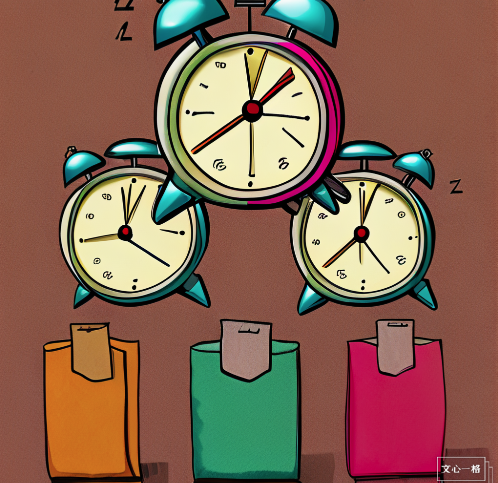

# RabbitMQ 延迟消息实现定时任务

## 背景

某个项目需要使用设定多个定时任务，且这些定时任务的执行时间、执行参数都要动态变化，因此开始寻找一些方法实现。由于项目中使用了 Redis 和 RabbitMQ 等中间件，且考虑后续跨语言的生产-消费，因此考察了使用这两种中间件来实现定时任务的方法。

发现可以用 AI 画图来作为文章的封面画。不过有一说一，质一般般吧，看来现在 AI 还是画大奶子比较专业。



## 方案对比

### Redis 键空间通知

Redis 的键可以设置 TTL，也就是超过一段时间会自动删除，此前我们使用这种技术做过登录超时的判断。这次调研发现，Redis 还可以订阅键空间通知，当键被操作时，订阅者可以收到消息。

在网上找了几个 Demo，也确实实现了功能，不过 Redis 官网给出了如下的说明：

> The expired events are generated when a key is accessed and is found to be expired by one of the above systems, as a result there are no guarantees that the Redis server will be able to generate the expired event at the time the key time to live reaches the value of zero.

也就是说，Redis 只保证超时后再用这个 Key 不可用，但不保证 TTL 到了的时候马上就会发通知。虽然我的几个测试都是按时收到了通知，但是看到这个，感觉还是有点不太靠谱。

### RabbitMQ 死信队列

在消息被拒收、消息消费超时、队列满等情况下，消息变成“死信”。我们可以在 RabbitMQ 中声明一个死信交换机，专门接收死信。在消息或发送队列中，都可以设置 TTL，又不去消费，这样消息就会落入死信交换机中，并通过正常的路由渠道发送至死信交换机的各路绑定中。

但利用死信队列有一个问题，就是 RabbitMQ 中的数据按照先入先出的顺序被使用，检查队列中各消息是否过期也只会检查第一个。那么如果分别设置各条消息的 TTL，那么可能导致第一条未超时，而后面超时了也判断不出来的情况。因此在具体使用时需要根据不同的超时时间设置多个队列。

### RabbitMQ 延迟消息

RabbitMQ 官方提供了[延时消息插件](https://github.com/rabbitmq/rabbitmq-delayed-message-exchange)。使用该插件，用户可以声明具有延时处理功能的交换机，并可以为每条消息设置延时，从而实现延迟发信功能。

## RabbitMQ 延迟消息使用

### 插件安装（Docker 版本）

非 Docker 版本的跟着 Github 中的说明做就好；Docker 版本的大概也差不多。

考虑到插件和 RabbitMQ 兼容性的问题，这里我 RabbitMQ 和插件都选用 3.10.2 版本。首先在本机下载插件`rabbitmq_delayed_message_exchange-3.10.2.ez `。然后需要确认插件路径，并通过 Docker 命令将插件复制到容器内。

```shell
# 查询插件路径
docker exec rabbitmq rabbitmq-plugins directories
# 根据查询结果复制到指定位置
docker cp rabbitmq_delayed_message_exchange-3.10.2.ez rabbitmq:/opt/rabbitmq/plugins
# 启用插件，这里注意插件名不需要带版本号也不需要带后缀
docker exec rabbitmq rabbitmq-plugins enable rabbitmq_delayed_message_exchange
# 验证
docker exec rabbitmq rabbitmq-plugins list
```

### 使用案例（Python）

使用延迟消息时，首先要确保交换机的类型为`x-delay-type`，再通过`x-delayed-message`参数设置交换机的功能类型：

```python
channel.exchange_declare(exchange='test-exchange',
                        exchange_type='x-delayed-message',
                        arguments={"x-delayed-type": "fanout"})
```

其次，发送消息时，使用`x-delay`属性来设置延时（单位为毫秒）：

```python
channel.basic_publish(exchange='test-exchange',
                    routing_key='test_route',
                    properties=pika.BasicProperties(
                        headers={'x-delay': 2500}
                    ),
                    body='Hello World!')
```

完整的代码如下.
`config.py`设置了一些公用的连接参数

```python
# 卧槽居然提交了密码，赶紧远程改一下
# 不过+1S真是很好的密码后缀
RABBIT_HOST = 'cn.zhangrichard.com'
RABBIT_USER = 'admin'
RABBIT_PASSWORD = 'Rabbit+1S'
RABBIT_EXCHANGE = 'delay-demo'
```

`consumer.py`封装了消费者类

```python
import config

import pika
import threading


class Consumer:

    def __init__(self, queue_name: str, name: str):
        self.queue_name = queue_name
        self.name = name

    # 消息处理
    def __callback(self, ch, method, properties, body):
        print(f'{self.name} RECEIVE {body.decode("utf-8")}')

    # 收取数据
    def __start(self):

        # RabbitMQ连接
        credentials = pika.PlainCredentials(
            username=config.RABBIT_USER, password=config.RABBIT_PASSWORD)
        parameters = pika.ConnectionParameters(
            host=config.RABBIT_HOST, credentials=credentials)
        connection = pika.BlockingConnection(parameters=parameters)
        channel = connection.channel()

        # 声明Exchange，声明为可延时的Exchange
        channel.exchange_declare(
            config.RABBIT_EXCHANGE,
            exchange_type='x-delayed-message',
            auto_delete=True,
            arguments={"x-delayed-type": "fanout"})
        # 声明队列
        channel.queue_declare(self.queue_name, auto_delete=True)
        # 创建绑定
        channel.queue_bind(queue=self.queue_name,
                           exchange=config.RABBIT_EXCHANGE)
        # 开始消费
        channel.basic_consume(
            queue=self.queue_name, on_message_callback=self.__callback, auto_ack=True)
        channel.start_consuming()

    # 开始收取数据
    def start(self):
        t = threading.Thread(target=self.__start)
        t.start()

```

`main.py`中使用了三个消费者，验证延迟交换机的功能除了延迟外是否与一般交换机一致

```python
import consumer

# 三个消费者
consumer11 = consumer.Consumer('Queue1', 'Consumer11')
consumer12 = consumer.Consumer('Queue1', 'Consumer12')
consumer2 = consumer.Consumer('Queue2', 'Consumer20')

# 开启各消费者
consumer11.start()
consumer12.start()
consumer2.start()

```

`producer.py`单独使用，用来发送消息。

```python
import config

import pika
import time


class Producer:

    # 通过连接和名字来进行生产者初始化
    def __init__(self, name: str):
        self.name = name

    # 定时发送数据
    def send(self):

        # RabbitMQ连接
        credentials = pika.PlainCredentials(
            username=config.RABBIT_USER, password=config.RABBIT_PASSWORD)
        parameters = pika.ConnectionParameters(
            host=config.RABBIT_HOST, credentials=credentials)
        connection = pika.BlockingConnection(parameters=parameters)
        channel = connection.channel()

        # 声明Exchange，声明为可延时的Exchange
        channel.exchange_declare(
            config.RABBIT_EXCHANGE,
            exchange_type='x-delayed-message',
            auto_delete=True,
            arguments={"x-delayed-type": "fanout"})
        # 不断发送消息
        cnt = 1
        while True:
            message = f'MESSAGE {self.name}-{cnt}'
            channel.basic_publish(
                config.RABBIT_EXCHANGE, '', message.encode('utf-8'),
                properties=pika.BasicProperties(headers={'x-delay': 5000}),
            )

            cnt = cnt + 1
            time.sleep(1)
            break

        connection.close()


if __name__ == '__main__':
    producer = Producer('you')
    producer.send()

```

开启`main.py`监听后，通过`producer.py`发送的消息，观察到可以通过设置的延时进行接收。

### 局限性

RabbitMQ 的延迟消息使用有一些局限性，[这篇文章](https://www.cloudamqp.com/blog/how-to-avoid-the-pitfalls-of-the-delayed-message-exchange.html)中给出了比较详尽的说明。

根据我的理解，局限性主要在可靠性和性能两个方面。在可靠性方面，延迟队列交换机仅把数据存放在创建交换机的节点中，如果节点挂掉了，消息也就 miss 了。在性能方面，延迟消息交换机使用 Mnesia(Erlang 标准库中的一个数据库)进行存储，没有针对消息队列进行优化，因此无论是性能上还是在数据大的情况下都会存在一些问题。这点官网说明上也提出了：

> Current design of this plugin doesn't really fit scenarios with a high number of delayed messages (e.g. 100s of thousands or millions).

不过一般战士的使用情景，也很少会有超过 10W 或更高级别的定时任务，因此也没啥太大问题。
