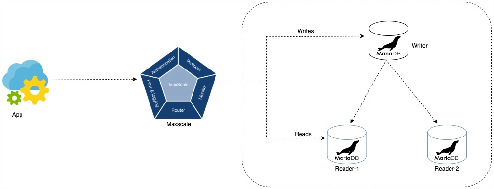
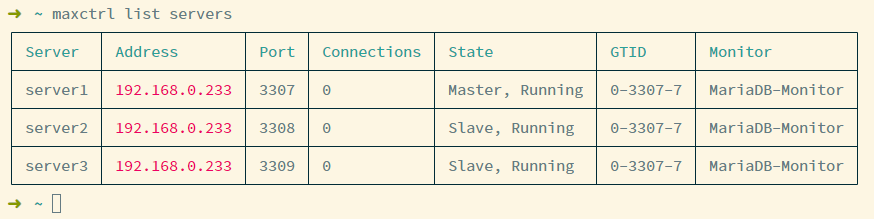

# 实现 MariaDB 高可用部署

## 背景

通过 MaxScale 中间件，实现 MariaDB 数据库的读写分离、负载均衡和失效处理。除主节点失效的处理外，MaxScale 中间件也可以实现对 MySQL 的支持。

部分配置与软件版本有关，在此列出：

```
Kernel Linux 4.18.0-425.13.1.el8_7.x86_64
podman 4.2.0
MariaDB 10.11.2
MaxScale 23.02.1
```

## 总体架构

采用 MaxScale 中间件后，上层应用只与 MaxScale 通信，数据库间的通信对应用透明，总体架构如图。



## 部署 MariaDB 一主二从集群

使用 Podman 启动三个 MariaDB，分别暴露 3307、3308、3309 端口，并挂载配置目录和数据目录（目录需提前建立）。

```shell
podman run -d --name mysql3307 -p 3307:3306 -v /home/zhang/mysql/mysql3307/data:/var/lib/mysql -v /home/zhang/mysql/mysql3307/config:/etc/mysql/conf.d -e MYSQL_ROOT_PASSWORD=xxxx mariadb:10.11.2 --default-authentication-plugin=mysql_native_password

podman run -d --name mysql3308 -p 3308:3306 -v /home/zhang/mysql/mysql3308/data:/var/lib/mysql -v /home/zhang/mysql/mysql3308/config:/etc/mysql/conf.d -e MYSQL_ROOT_PASSWORD=xxxx mariadb:10.11.2 --default-authentication-plugin=mysql_native_password

podman run -d --name mysql3309 -p 3309:3306 -v /home/zhang/mysql/mysql3309/data:/var/lib/mysql -v /home/zhang/mysql/mysql3309/config:/etc/mysql/conf.d -e MYSQL_ROOT_PASSWORD=xxxx mariadb:10.11.2 --default-authentication-plugin=mysql_native_password
```

在三个挂载的配置目录中分别添加配置文件 `my.cnf`

```my.cnf
[mysqld]
# ID需要唯一
server-id=3307
# 开启日志
log-bin=log-bin-3307
binlog_format=ROW
# 使用GTID模式，此处注意，MySQL配置与此有区别
gtid_strict_mode=1


[mysqld]
# ID需要唯一
server-id=3308
# 开启日志
log-bin=log-bin-3308
binlog_format=ROW
# 使用GTID模式，此处注意，MySQL配置与此有区别
gtid_strict_mode=1


[mysqld]
# ID需要唯一
server-id=3309
# 开启日志
log-bin=log-bin-3309
binlog_format=ROW
# 使用GTID模式，此处注意，MySQL配置与此有区别
gtid_strict_mode=1
```

在三个 MariaDB 中分别创建同步用账号（分别执行，共执行三组）

```SQL
CREATE USER 'slave'@'%' IDENTIFIED BY 'xxxx';
GRANT REPLICATION SLAVE, REPLICATION CLIENT ON *.* TO 'slave'@'%';
```

重启三个容器，以读取配置文件中内容

```shell
podman restart mysql3307 mysql3308 mysql3309
```

在 3308、3309 中设置 3307 为主，形成一主二从，并查看状态（分别在 3308、3309 中执行）

```SQL
STOP SLAVE;

# 其中IP应为内网IP，避免使用localhost导致容器内无法访问
CHANGE MASTER TO master_host='192.168.0.233', master_user='slave', master_password='xxxx', master_port=3307;

START SLAVE;
SHOW SLAVE STATUS\g;
```

验证，在主库中建库建表添加数据，可以在从库中进行查询

```SQL
# 在3307中建库建表，添加数据
CREATE DATABASE test;
USE test;

CREATE TABLE student
(`id` INT NOT NULL, `name` VARCHAR(255) NOT NULL DEFAULT '');

INSERT INTO student
(id, name)
VALUES
(1, 'Jack'),
(2, 'Rose');

# 在3308、3309中查询
SELECT * FROM test.student;
+----+------+
| id | name |
+----+------+
|  1 | Jack |
|  2 | Rose |
+----+------+
```

设置非根服务，并设置自动启动

```shell
mkdir -p ~/.config/systemd/user
podman generate systemd --files --name mysql3307
podman generate systemd --files --name mysql3308
podman generate systemd --files --name mysql3309
mv *.service ~/.config/systemd/user
systemctl --user daemon-reload
systemctl --user enable container-mysql3307.service container-mysql3308.service container-mysql3309.service
loginctl enable-linger
```

## 运行配置 MaxScale 中间件

在 3307 节点中，创建 MaxScale 监控用户和路由用户

```SQL
CREATE USER scalemon@'%' identified BY "xxxx";
GRANT REPLICATION CLIENT, REPLICATION SLAVE, FILE, SUPER, RELOAD, PROCESS, SHOW DATABASES, EVENT, READ ONLY ADMIN ON *.* TO scalemon@'%';

CREATE USER maxscale@'%' identified BY "xxxx";
GRANT select ON mysql.* TO maxscale@'%';
```

准备`mysql/maxscale/maxscale.cnf`文件，准备挂载至 MaxScale 容器

```maxscale.cnf
[maxscale]
# 线程个数，设置为auto为与CPU核数相同
threads=auto
# 监听IP及端口
admin_host=0.0.0.0
admin_port=8989

# 三个MySQL服务的配置，一主二从
[server1]
type=server
address=192.168.0.233
port=3307
protocol=MariaDBBackend

[server2]
type=server
address=192.168.0.233
port=3308
protocol=MariaDBBackend

[server3]
type=server
address=192.168.0.233
port=3309
protocol=MariaDBBackend

# 监控配置
# 用户名密码为上面监测用账号
[MariaDB-Monitor]
type=monitor
module=mariadbmon
servers=server1,server2,server3
user=scalemon
password=xxxx
monitor_interval=2s
auto_failover=true
auto_rejoin=true

# 读写分离配置
# 用户名密码为上面查询用账号
[Read-Write-Service]
type=service
router=readwritesplit
servers=server1,server2,server3
user=maxscale
password=xxxx
enable_root_user=true

[Read-Write-Listener]
type=listener
service=Read-Write-Service
protocol=MariaDBClient
port=3306
```

启动 MaxScale 容器，并挂载配置文件、映射端口，并验证能够读取到的服务端（我在宿主机中提前安装了 maxctrl 工具，也可以在容器中执行下面第二个命令）

```shell
podman run -d --name maxscale -p 8989:8989 -p 3306:3306 -v /home/zhang/mysql/maxscale/maxscale.cnf:/etc/maxscale.cnf mariadb/maxscale:23.02.1

maxctrl list servers
```

可见已经能识别到三个数据库，组成了一主二从的集群。



设置非根服务，并设置自动启动

```shell
podman generate systemd --files --name maxscale
mv *.service ~/.config/systemd/user
systemctl --user daemon-reload
systemctl --user enable container-maxscale.service
loginctl enable-linger
```

## 验证测试

### 读写分离测试

通过 MaxScale 连接 MySQL（3306 端口），并多次进行查询操作，可以发现请求被路由至两个从节点

```SQL
# 本次被路由至3308节点
SELECT @@hostname;
+--------------+
| @@hostname   |
+--------------+
| 02d9d44d76e7 |
+--------------+

# 本次被路由至3309节点
SELECT @@hostname;
+--------------+
| @@hostname   |
+--------------+
| 6b94471a8c1c |
+--------------+
```

开启事务后，发现被路由至主节点

```SQL
START TRANSACTION;
# 本次被路由至主节点
SELECT @@hostname;
+--------------+
| @@hostname   |
+--------------+
| f059040d2afd |
+--------------+
ROLLBACK;
```

### 从节点失效测试

在停掉 3308 后通过 MaxCtrl 查询服务状态，并查看路由情况。

```shell
# 停掉一个节点
systemctl --user stop container-mysql3308.service
maxctrl list servers
```

再在 MySQL 中查看路由，发现多次读请求都被路由至存活的从节点。

```SQL
# 多次请求，均发送给存活的3309节点
SELECT @@hostname;
+--------------+
| @@hostname   |
+--------------+
| 02d9d44d76e7 |
+--------------+
```

停掉 3309 节点，此时所有从节点均挂掉。

```shell
# 停掉另一个节点
systemctl --user stop container-mysql3309.service
maxctrl list servers
```

再在 MySQL 中查看路由，发现多次读请求都被路由至主节点。

```SQL
# 多次请求，均发送给主节点3307
SELECT @@hostname;
+--------------+
| @@hostname   |
+--------------+
| f059040d2afd |
+--------------+
```

### 主节点失效测试

重新启动两个从节点，并关闭主节点，此时查看 MaxScale 状态

```shell
systemctl --user start container-mysql3308.service container-mysql3309.service
systemctl --user stop container-mysql3307.service
maxctrl list servers
```

过一会儿后，发现 server2 的状态已经变为`Master, Running`，且通过日志能够看出，server3 的主机也切换为 server2，证明主节点失效后，MaxScale 会自动选择新的主节点。
