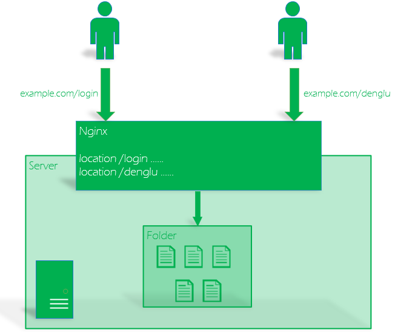

# 前端项目多环境非根部署

## 需求

目前公司有多个部署环境，如局域网开发测试环境、线上演示环境、数据录入环境以及多个业主的生产环境。现在希望同一个产品（如登录中心）在不同的环境中使用不同的 pathname(url 中的尾缀)来访问，如：

在开发环境中，登录中心为 `http://192.168.0.101/login`

在演示环境中，登录中心为 `https://demo.example.com/denglu`

## 当前实现

目前使用前后端分离的方式进行开发，前端使用 React 框架开发后经由 webpack 打包；打包生成的文件放置在服务器的某个目录中，并使用 Nginx 提供静态文件服务。

在当前的实现中，使用 webpack（或各种 umi 封装）的 publicPath 配置项来指定资源路径；同时，在 Nginx 的配置中也指定相同的 location 名字；这样就可以正确地找到各种资源（js/css 等）。如以下前端配置和 Nginx 配置，可以实现在`example.com/login`访问前端页面：

```.umirc.js
  define: {
    'process.env.API_ENV': process.env.API_ENV,
  },
  history: 'hash',
  publicPath: '/login/',
```

```nginx.conf
  location /login {
    alias /home/admin/static/login/;
  }
```

不足之处在于，如果希望在多个环境中使用不同的 pathname 访问同一个产品，则需要修改前端代码；如果环境较多，则需要维护多个代码分支或增加打包时的工作量。

## 更新实现

根据[webpack 官方对于 publicPath 的解释](https://webpack.js.org/guides/public-path/)，理解 publicPath 就是定义各类资源相对于 index.html 的路径

> This includes child chunks (created via code splitting) and any other assets (e.g. images, fonts, etc.) that are a part of your dependency graph.

因此，可以简单粗暴地将 publicPath 设置为`./`，这样所有资源的请求都是相对于当前访问地址的，想要在不同环境中设置不同的 pathname,只需要在 Nginx 中设置 location 就可以，甚至可以在同一个环境中使用不同的 pathname 访问同一个产品。

以下示例演示使用 `login` 和 `denglu` 两个 pathname 来访问登录中心：

```.umirc.js
  history: 'hash',
  publicPath: './',
```

```nginx.conf
  # 该配置支持 example.com/login访问该产品
  location /login {
    alias /home/admin/static/login/;
  }

  # 该配置支持 example.com/denglu访问该产品
  # 可以看到，被alias的目录与上面是同一个
  location /denglu {
    alias /home/admin/static/login/;
  }
```

总体效果如下图所示：


