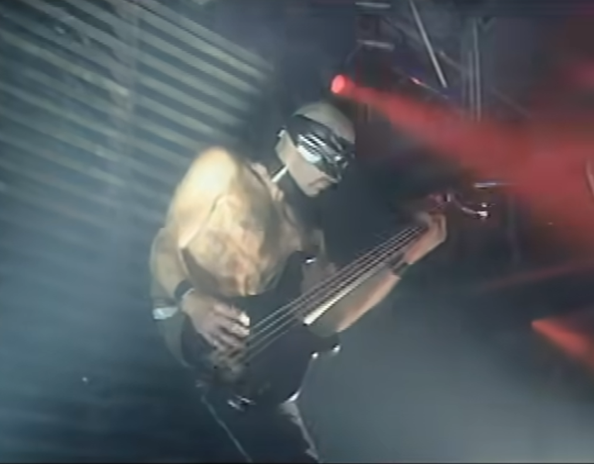

# 使用 FFmpeg 实现拼接屏视频

## 需求

宣传组的小伙伴过来找我，说领导想做宣传视频，要把我们之前做的一些系统录屏，然后搞成一个九宫格播放出来。虽然他也觉得这样看不清，但是会给人不明觉厉的感觉，从而起到宣传的作用……

于是，需求就很简单，录制九个系统操作视频，然后拼接在一起，形成一个和原始尺寸一样的九宫格视频（这里假定每个录屏尺寸一样）

## 总体流程

总体流程非常清晰，就是录屏-缩放-拼接。

录屏就是请各个产品负责人录制一下软件操作，尽量挑选一些花哨的操作，这样显得更牛逼；缩放就是，因为录制的原始视频会比较大，如果要形成 3x3 的九宫格，就得每个都缩放成之前 1/3 左右的大小，这样拼接起来和原始尺寸一样；拼接就是简单地在几何上排布成 3x3 的矩阵，同时播放，考虑到各视频的时长可能不同，这里按照最长视频为准，其他的循环播放就行（反正大家也看不清）。



## 录屏

这里只是安利下录屏的工具 XBox Game Bar， Win10 或者 Win11 默认就有，快捷键 Win+G 可以弹出来，一般的录屏需求就可以满足了，不用再去下载各种第三方工具。

为了演示，我在自己电脑上录制了 B 站上[德国战车的嗨歌](https://www.bilibili.com/video/BV1y4411u7YR/)，有点黑边，大概量了一下，去掉黑边后视频尺寸大概为 1410x810；生成的 9 个视频分别命名为`Asche-zu-Asche-{1-9}.mp4`，便于后面操作

## 缩放

这步将录制好的九个视频分别进行缩放，使得每个长宽都是之前的 1/3 左右；需要注意，FFmpeg 缩放时要求长宽都为偶数，所以如果除出来是奇数或者有小数，就近似一下。

我写了一个 bat 脚本，可以对 9 个视频分别进行操作

```scale.bat
for /l %%i in (1 1 9) do (
    ffmpeg -i Asche-zu-Asche-%%i.mp4 -vf crop=1410:810:255:135 small-%%i.mp4
)

for /l %%i in (1 1 9) do (
    ffmpeg -i small-%%i.mp4 -vf scale=470:270 Asche-zu-Asche-small-%%i.mp4
)
```

之后，会生成 9 个小一些的视频文件，分别命名为`Asche-zu-Asche-small-{1-9}.mp4`

## 拼接

FFmpeg 拼接的原理很简单，可以理解为一个大的画布，分别将各个视频放到指定的位置。实现时，主要使用 FFmpeg 中的 overlay 功能，各个被叠加的视频类似于 PS 中的图层；通过这个功能，还可以实现加水印等其他操作，感兴趣可以自行谷歌。

在 overlay 的语法中，可以使用[n:v]来指定从 0 开始的各个输入视频，比如[0:v]、[114514:v]等；此外，每个视频的处理可以像管道一样，有一个输入流和一个输出流，这样类似于一个接一个第将视频进行处理。

以下为拼接 9 个视频的代码

```cmd
set v1=[0:v]pad=1410:810[tmp1];
set v2=[tmp1][1:v]overlay=x=470:y=0[tmp2];
set v3=[tmp2][2:v]overlay=x=940:y=0[tmp3];
set v4=[tmp3][3:v]overlay=x=0:y=270[tmp4];
set v5=[tmp4][4:v]overlay=x=470:y=270[tmp5];
set v6=[tmp5][5:v]overlay=x=940:y=270[tmp6];
set v7=[tmp6][6:v]overlay=x=0:y=540[tmp7];
set v8=[tmp7][7:v]overlay=x=470:y=540[tmp8];
set v9=[tmp8][8:v]overlay=x=940:y=540

ffmpeg ^
-stream_loop -1 -i Asche-zu-Asche-small-1.mp4 ^
-stream_loop -1 -i Asche-zu-Asche-small-2.mp4 ^
-stream_loop -1 -i Asche-zu-Asche-small-3.mp4 ^
-stream_loop -1 -i Asche-zu-Asche-small-4.mp4 ^
-stream_loop -1 -i Asche-zu-Asche-small-5.mp4 ^
-stream_loop -1 -i Asche-zu-Asche-small-6.mp4 ^
-stream_loop -1 -i Asche-zu-Asche-small-7.mp4 ^
-stream_loop -1 -i Asche-zu-Asche-small-8.mp4 ^
-stream_loop -1 -i Asche-zu-Asche-small-9.mp4 ^
-filter_complex %v1%%v2%%v3%%v4%%v5%%v6%%v7%%v8%%v9% ^
-vcodec libx264 demo.mp4
```

最终的效果就是这样，我生成了GIF，便于炫耀


