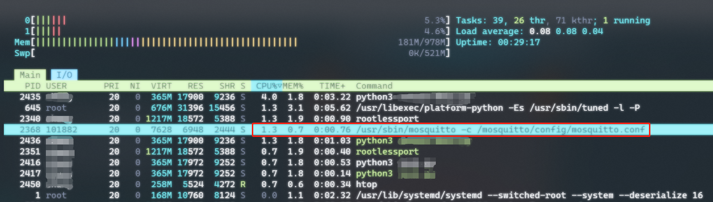
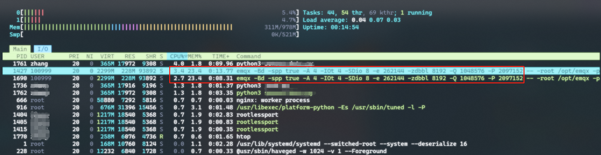

# 配置使用 Mosquitto

## 背景

做一个小型项目，需要在设备上采集数据，并在网页中实时显示。

经过技术分析，现在 JS 也有 MQTT 的库，所以可以直接使用 MQTT 协议来进行数据传输，这样就避免了后端开发。

由于项目规模小、局域网使用，因此也无所谓高并发或者权限等，就怎么简单怎么来了。

一开始 MQTT Broker 选用的是 EMQX。说实话 EMQX 还是挺好的，他们销售老给我打电话，我说我用社区版够用，他们也不要求我必须购买啥的，而且功能挺丰富，又有比较好的 Web 管理页面。

但是，我用的是一个贼破的云服务器(2vCPU 1G 内存)，所以跑 EMQX 经常跑着跑着就扛不住了，于是找到了这个中文名叫“蚊子”的轻量级 MQTT Broker — Mosquitto

## Mosquitto 介绍

用 ChatGPT 水水字数……


Mosquitto 是一个开源的 MQTT Broker，专注于实现 MQTT 协议的消息传递功能。以轻量级设计为特点，在资源受限的设备和网络环境中表现出色，它的代码库精简，占用的系统资源较少，适合嵌入式设备和低功耗环境; Mosquitto 被设计为高性能的 MQTT 代理。它能够高效地处理大量的消息传递请求，确保消息在发布者和订阅者之间快速可靠地传递，适用于需要快速响应的应用场景; Mosquitto 提供了多种安全功能，包括用户名/密码认证、TLS/SSL 加密通信等，以确保消息在传递过程中的保密性和完整性。

其他的就不抄了，我的需要很简单，就是轻量级、性能不太差、支持 WebSocket 和用户名密码认证、TLS/SSL 加密通信。

## Mosquitto 安装

其实比较好的方法是直接用容器运行，但是考虑到服务器性能已经比较差了，yum 源里的版本又比较老，就记录下编译安装的过程。

### 依赖库的安装

首先根据 GitHub 上的指示，确保一些依赖库的安装（以 Rocky Linux 为例，其他操作系统类似）

```shell
sudo dnf install c-ares c-ares-devel
sudo dnf install cjson cjson-devel
sudo dnf install openssl3-libs openssl3-devel
```

### libwebsockets 的手动编译

如果需要 Websocket 支持，还需要安装 libwebsockets，**但这里需要注意**，直接从仓库里安装的 libwebsockets 在编译时没有带`LWS_WITH_EXTERNAL_POLL`参数，编译时会有警告，会导致 Mosquitto 的 WebSocket 性能下降（[参考这个 issue](https://github.com/eclipse/mosquitto/issues/2060)），因此这里我们手动编译一下 libwebsockets

```shell
git clone https://github.com/warmcat/libwebsockets.git
cd libwebsockets
git checkout origin/v4.3-stable

mkdir build
cd build
cmake .. -DLWS_WITH_EXTERNAL_POLL=ON
```

**需要注意**，这里 cmake 之后如果直接 make，编译会报错，[参考这个 issue](https://github.com/warmcat/libwebsockets/issues/2790)，需要修改一下头文件`lws_config.h`，在`LWS_WITH_EXTERNAL_POLL`前后加入`#ifndef`和`#endif`保护，避免重定义。

```shell
make
sudo make install
sudo ldconfig
```

### Mosquitto 的编译和安装

在搞定各个依赖项后，可以进行 Mosquitto 的编译和安装

```shell
wget https://mosquitto.org/files/source/mosquitto-2.0.14.tar.gz
tar zxvf mosquitto-2.0.14.tar.gz
cd mosquitto-2.0.14
make WITH_SRV=yes WITH_CJSON=yes WITH_WEBSOCKETS=yes WITH_TLS=yes
sudo make install
```

## Mosquitto 的配置使用

我将配置文件和密码文件都放在`/usr/loca/etc/mosquitto`中，如果没有目录，需要自行创建。

密码文件需要使用`mosquitto_passwd`命令创建，命令中指定输出文件路径和用户名，命令执行过程中会要求输入密码和确认密码

```shell
sudo /usr/local/bin/mosquitto_passwd -c /usr/local/etc/mosquitto/passwd_file FUCKING_USER
```

编写配置文件

```/usr/local/etc/mosquitto/mosquitto.conf
allow_anonymous false
password_file /usr/local/etc/mosquitto/passwd_file

listener 1883 0.0.0.0

listener 9001 0.0.0.0
protocol websockets
```

以上配置，禁用了匿名登录，制定了密码文件；同时开放了两个端口，1883 为 MQTT 协议端口，9001 为 WebSocket 端口。

为了自动启动等，将 Mosquitto 封装为系统服务。

```/usr/lib/systemd/system/mosquitto.service
[Unit]
Description=Mosquitto MQTT Broker
Documentation=man:mosquitto.conf(5) man:mosquitto(8)
After=network.target
Wants=network.target

[Service]
ExecStart=/usr/local/sbin/mosquitto -c /usr/local/etc/mosquitto/mosquitto.conf
ExecReload=/bin/kill -HUP $MAINPID
Restart=on-failure

[Install]
WantedBy=multi-user.target
```

最后，启动服务并设置为开机自动启动

```shell
sudo systemctl start mosquitto
sudo systemctl enable mosquitto
```

## 性能对比

本文要解决的问题就是，在小型项目、低配置服务器环境下，MQTT Broker 占用资源过多的问题。现在就对比一下 Mosquitto 和 EMQX

测试的情况和实际使用一致，有 2 个生产者使用 MQTT 发送数据（分别为 10Hz、100Hz，均为 JSON），有 1 个消费者通过 WebSocket 消费数据。

为尽量屏蔽差异，Mosquitto 和 EMQX 都是用 Podman 容器运行：

```shell
podman run -d --name=mosquitto -p 1883:1883 -p 9001:9001 -v /mosquitto.conf:/mosquitto/config/mosquitto.conf eclipse-mosquitto

podman run -d --name emqx -p 1883:1883 -p 18083:18083 -p 8083:8083 -p 8084:8084  emqx:5.0.26
```

在 Mosquitto 的情况下，基本上 CPU 和内存的占用都在 1%



在 EMQX 情况下，系统资源占用如下：基本上 CPU 占用不高，在 2-3%，内存很高，达到 23%



在以上对比中，系统中其他进程（如数据库、Web 服务等）都已经关闭，可以对比 EMQX，Mosquitto 在资源占用上确实相当节约，适合于中小型项目。
